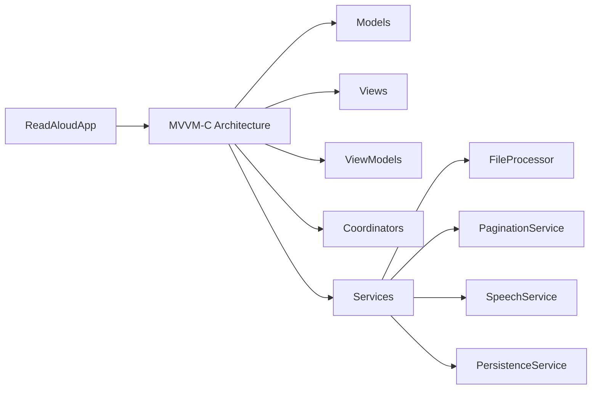

# ReadAloudApp Documentation

## Overview

This directory contains all documentation for the ReadAloudApp iOS project. The app is designed to provide a high-performance text reading experience with text-to-speech capabilities for large text files.

## Documentation Structure

### Core Documentation
- **[Project Context](project_context.md)** - Complete project specification and technical architecture
- **[Developer Guide](developer_guide.md)** - Setup instructions and development guidelines  
- **[Quick Reference](quick_reference.md)** - Quick lookup for common tasks and commands

### Epic Documentation
- **[Epic 1 - Core](epic_1_core/)** - Foundation and architecture tasks
  - [CORE-1](epic_1_core/core-1.md) ✅ - Initialize Xcode Project
  - [CORE-2](epic_1_core/core-2.md) - Implement MVVM-C Structure
  - [CORE-3](epic_1_core/core-3.md) - Define Core Data Models
  - [CORE-4](epic_1_core/core-4.md) - Implement AppError Enum
  - [CORE-5](epic_1_core/core-5.md) - Additional core tasks

## Project Status

### Current Sprint
- **Epic**: Core Architecture & Setup
- **Status**: CORE-1 & CORE-2 Complete ✅
- **Next**: CORE-3 - Define Core Data Models

### Completed Tasks
1. **CORE-1**: Initialize Xcode Project ✅
   - Created SwiftUI app with MVVM-C structure
   - Set up folder organization
   - Configured bridging header
   - Implemented basic navigation

2. **CORE-2**: Establish Swift/Objective-C Interoperability ✅
   - Configured bridging header in build settings
   - Created Objective-C demonstration classes
   - Verified seamless Swift/Objective-C integration
   - Added comprehensive interoperability tests

## Architecture Overview

## Key Features (Planned)
- 📚 Import and manage text files
- 📖 Lazy pagination for memory efficiency
- 🔊 Text-to-speech with word highlighting
- ⚙️ Customizable reading settings
- 💾 Progress persistence
- 📱 Support for large files (up to 2GB)

## Technology Stack
- **Platform**: iOS 17.0+
- **Language**: Swift 5.10+
- **UI Framework**: SwiftUI
- **Architecture**: MVVM-C
- **Dependencies**: Swift Package Manager

## Getting Started

1. Review the [Project Context](project_context.md)
2. Follow the [Developer Guide](developer_guide.md) for setup
3. Use [Quick Reference](quick_reference.md) for daily development

## Contributing

When working on tasks:
1. Check the epic folder for task details
2. Update CHANGELOG.md after implementation
3. Update relevant documentation
4. Follow the coding standards in the developer guide 