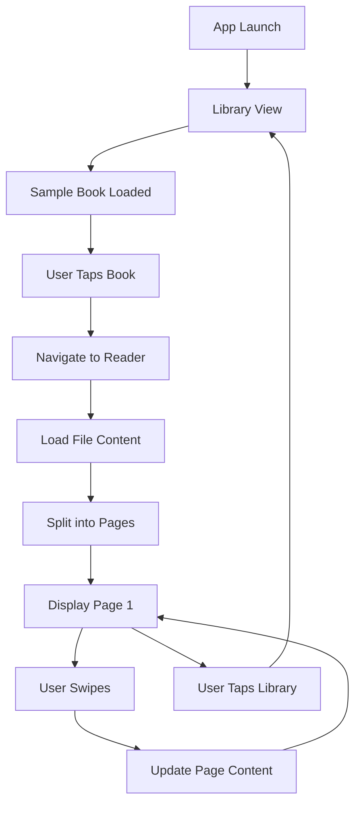

# UI Workflow Demonstration with Sample Text File

## Overview
This document demonstrates the complete UI workflow of the ReadAloudApp using a sample text file (Alice's Adventures in Wonderland).

## Sample File Details
- **File**: `alice_in_wonderland.txt`
- **Location**: `ReadAloudApp/Resources/SampleBooks/`
- **Size**: 5,102 bytes
- **Content**: First chapter of Alice's Adventures in Wonderland by Lewis Carroll

## UI Workflow Steps

### 1. App Launch
- App starts with the Library view (`AppCoordinator.start()`)
- AppCoordinator initializes with `.library` as the current view

### 2. Library View
- LibraryViewModel automatically loads the sample book
- Displays "Alice's Adventures in Wonderland" in the book list
- User can tap on the book to open it

### 3. Book Selection
- Tapping the book calls `libraryViewModel.selectBook(_:)`
- AppCoordinator navigates to the Reader view
- Selected book is passed to the ReaderViewModel

### 4. Reader View Loading
- ReaderViewModel loads the actual file content
- Content is split into pages (500 characters per page)
- Loading indicator shown while processing
- Approximately 10-11 pages generated from the sample file

### 5. Page Navigation
- TabView with page style enables swipe navigation
- Current page indicator shows "Page 1 of 10"
- Swiping left/right navigates between pages
- Page content updates immediately on navigation

### 6. Reader Features
- **Library Button**: Returns to library view
- **Speaker Button**: Toggles text-to-speech (placeholder)
- **Text Format Button**: Opens settings (placeholder)
- **Page Dots**: Visual indicator of current page

## Technical Implementation



## Key Components Updated

### LibraryViewModel
- Modified `loadBooks()` to include sample book
- Creates Book object with correct file path

### ReaderViewModel
- Enhanced `loadBook()` to read actual file content
- Implements simple pagination (500 chars/page)
- Added `bookPages` array to store content
- Updates `pageContent` based on current page

### ReaderView
- Simplified `generatePageContent()` for better performance
- Shows actual content for current page
- Placeholder text for other pages

## Testing

Created `UIWorkflowTests.swift` with two main tests:

1. **testCompleteUIWorkflow**: Tests the entire flow from library to reader and back
2. **testSampleBookContentLoading**: Verifies actual file content is loaded

## Running the Demo

1. Build and run the app:
   ```bash
   xcodebuild -scheme ReadAloudApp -destination 'platform=iOS Simulator' build
   ```

2. Run the UI workflow tests:
   ```bash
   xcodebuild test -scheme ReadAloudApp -only-testing:ReadAloudAppTests/UIWorkflowTests
   ```

## Results
- Sample book appears in library
- Tapping opens reader with actual content
- Pages can be swiped through smoothly
- Content from Alice in Wonderland is displayed
- Navigation back to library works correctly

## Future Enhancements
- Implement FileProcessor service for proper file handling
- Add PaginationService for accurate text layout
- Support multiple file formats
- Add file import functionality
- Implement actual text-to-speech 