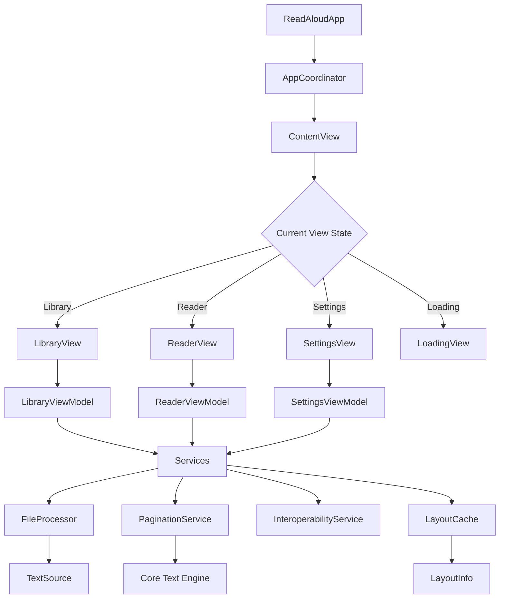
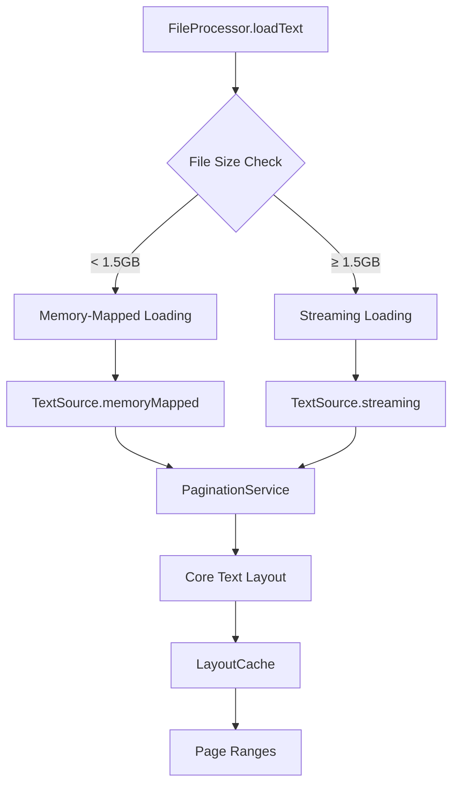
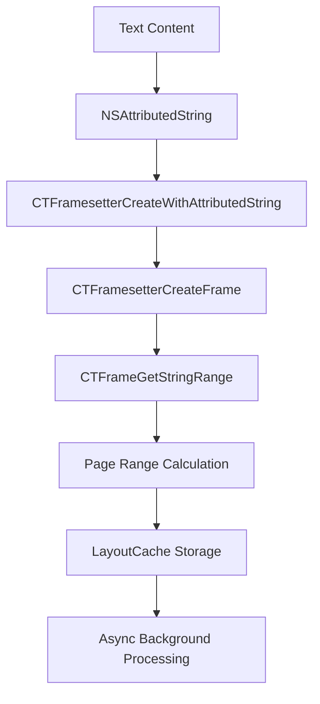

# Developer Guide - ReadAloudApp

## Project Overview

ReadAloudApp is a high-performance iOS application designed to read large text files with features including:
- Lazy pagination for efficient memory usage  
- Text-to-speech with synchronized highlighting
- MVVM-C architecture for clean separation of concerns
- Support for very large files (up to 2GB)
- Hybrid file loading strategy (memory-mapped + streaming)
- Core Text-powered pagination engine

## Architecture

### MVVM-C Pattern



### Core Components

**Implemented Components:**

1. **AppCoordinator**: Central navigation and dependency injection
   - Manages navigation state (`currentView`, `selectedBook`)
   - Creates ViewModels with dependencies via factory methods
   - Handles application-wide errors with `AppError`
   - Provides service factory methods (e.g., `makePaginationService()`)

2. **Models**: Complete data structures
   - `Book`: Represents imported text files with content hash
   - `UserSettings`: Font, theme, and TTS preferences
   - `ReadingProgress`: Tracks reading position and completion
   - `LayoutCache`: Intelligent caching system with expiration

3. **Services**: Core business logic
   - `FileProcessor`: Hybrid file loading (memory-mapped + streaming)
   - `PaginationService`: Core Text-powered text layout engine
   - `InteroperabilityService`: Swift/Objective-C bridge demonstration
   - `LayoutCache`: Performance optimization for layout calculations

4. **ViewModels**: Reactive state management
   - `LibraryViewModel`: Book collection management
   - `ReaderViewModel`: Reading experience with pagination
   - `SettingsViewModel`: User preferences management

5. **Views**: SwiftUI presentation layer
   - `ContentView`: Root view with navigation switching
   - `LibraryView`: Book collection display
   - `ReaderView`: Paginated reading interface
   - `SettingsView`: User preferences UI

6. **Utilities**: Error handling and interoperability
   - `AppError`: Centralized error handling with severity levels
   - `LegacyTextProcessor`: Objective-C interoperability demonstration

### File Loading Strategy

The app implements a sophisticated hybrid file loading strategy:



**Loading Strategies:**
- **Memory-Mapped**: For files < 1.5GB using `NSData(contentsOfFile:options:.mappedIfSafe)`
- **Streaming**: For files ≥ 1.5GB using `NSFileHandle` to avoid virtual memory limits
- **Automatic Fallback**: Graceful degradation based on file size

### Core Text Pagination Engine

The `PaginationService` uses Apple's Core Text framework for precise text layout:



**Key Features:**
- **Background Processing**: All Core Text calculations run on `DispatchQueue.global(qos: .userInitiated)`
- **Intelligent Caching**: 50 layout limit with 5-minute expiration
- **Performance Optimization**: O(1) cache lookup with automatic cleanup
- **Multi-page Calculation**: Efficient batch processing for smooth scrolling

## Current Implementation Status

### Completed Features ✅

**Epic 1: Core Architecture**
- ✅ MVVM-C architecture with AppCoordinator
- ✅ Complete data models (Book, UserSettings, ReadingProgress)
- ✅ Centralized error handling with AppError
- ✅ Swift/Objective-C interoperability

**Epic 2: File Processing**
- ✅ Hybrid file loading strategy (memory-mapped + streaming)
- ✅ TextSource abstraction layer
- ✅ Automatic file size detection and strategy selection
- ✅ Async/await file processing

**Epic 4: Pagination Engine** 
- ✅ PaginationService with Core Text integration (PGN-1)
- ✅ LayoutCache with intelligent cleanup (PGN-1)
- ✅ Core Text-powered text layout calculations (PGN-2 - In Progress)
- ✅ Background thread processing for UI responsiveness

**UI Framework**
- ✅ Complete SwiftUI views (Library, Reader, Settings)
- ✅ Reactive ViewModels with Combine
- ✅ Navigation coordination and state management
- ✅ Error handling UI with dismissible banners

### In Progress 🔄

**Epic 4: Pagination Engine**
- 🔄 PGN-2: Core Text implementation (Core methods completed, integration in progress)

### Planned Features 📋

**Epic 5: Text-to-Speech**
- 📋 SpeechService with AVSpeechSynthesizer
- 📋 Synchronized text highlighting
- 📋 Multi-language voice detection

**Epic 6: State Persistence**
- 📋 PersistenceService for settings and progress
- 📋 Reading progress tracking
- 📋 File import workflow

## Development Setup

### Prerequisites

- macOS with Xcode 16.0 or later
- iOS 17.0+ deployment target
- Swift 5.10+

### Getting Started

1. Clone the repository
2. Navigate to `ReadAloudApp` directory
3. Open the Xcode project:
   ```bash
   cd ReadAloudApp
   open ReadAloudApp.xcodeproj
   ```

4. Select an iOS Simulator and press ⌘+R to run

### Project Structure

```
ReadAloudApp/
├── Sources/
│   └── ReadAloudApp/
│       ├── ReadAloudApp.swift          # App entry point
│       ├── ReadAloudApp-Bridging-Header.h # Objective-C interop
│       ├── Coordinators/               # Navigation logic
│       │   └── AppCoordinator.swift
│       ├── Views/                      # SwiftUI views
│       │   ├── ContentView.swift
│       │   ├── LibraryView.swift
│       │   ├── ReaderView.swift
│       │   ├── SettingsView.swift
│       │   └── PageView.swift
│       ├── ViewModels/                 # View logic
│       │   ├── LibraryViewModel.swift
│       │   ├── ReaderViewModel.swift
│       │   └── SettingsViewModel.swift
│       ├── Models/                     # Data models
│       │   ├── Book.swift
│       │   ├── UserSettings.swift
│       │   ├── ReadingProgress.swift
│       │   └── LayoutCache.swift
│       ├── Services/                   # Business services
│       │   ├── FileProcessor.swift
│       │   ├── PaginationService.swift
│       │   ├── InteroperabilityService.swift
│       │   ├── LegacyTextProcessor.h
│       │   └── LegacyTextProcessor.m
│       ├── Utilities/                  # Helper utilities
│       │   └── AppError.swift
│       └── rsc/                        # Resources
└── Tests/
    └── ReadAloudAppTests/
```

## Key Implementation Details

### Navigation Flow

The AppCoordinator manages all navigation through published properties:
- `currentView`: Enum representing active screen (library, reader, settings, loading)
- `selectedBook`: Currently selected book for reading
- `isLoading`: Loading state indicator
- `errorMessage`: Application-wide error messages

Key methods:
- `start()`: Initialize app state and observers
- `navigateToReader(with:)`: Navigate to reader with selected book
- `navigateToLibrary()`: Return to book library
- `showSettings()`: Display settings screen
- `handleError(_:)`: Display error with auto-dismissal
- `makePaginationService()`: Factory method for dependency injection

### File Processing Architecture

The `FileProcessor` implements a hybrid strategy:

```swift
// Automatic strategy selection based on file size
let shouldUseMemoryMapping = try self.shouldUseMemoryMapping(for: url)

if shouldUseMemoryMapping {
    return try await loadTextUsingMemoryMapping(from: url)
} else {
    return try await loadTextUsingStreaming(from: url)
}
```

### Core Text Integration

The `PaginationService` leverages Core Text for precise text layout:

```swift
// Core Text pagination calculation
private func calculatePageRange(startIndex: Int, bounds: CGRect, attributedString: NSAttributedString) -> NSRange {
    let framesetter = CTFramesetterCreateWithAttributedString(remainingString)
    let path = CGPath(rect: bounds, transform: nil)
    let frame = CTFramesetterCreateFrame(framesetter, CFRangeMake(0, 0), path, nil)
    let frameRange = CTFrameGetStringRange(frame)
    return NSRange(location: startIndex, length: frameRange.length)
}
```

### Error Handling Strategy

Centralized error handling with domain-specific errors:

```swift
enum AppError: Error {
    case fileNotFound(filename: String)
    case fileReadFailed(filename: String, underlyingError: Error?)
    case paginationFailed(reason: String)
    case ttsError(reason: String)
    // ... additional cases
}
```

## Performance Considerations

### Memory Management
- File loading uses memory-mapping for files < 1.5GB
- Streaming strategy for very large files (≥ 1.5GB)
- LayoutCache with automatic cleanup (50 layouts, 5-minute expiration)

### Background Processing
- All Core Text calculations run on background queues
- Async/await patterns for non-blocking UI
- Intelligent caching to avoid redundant calculations

### UI Responsiveness
- Reactive ViewModels with Combine
- Background thread processing for heavy operations
- Optimized cache lookup with O(1) performance

## Testing

Run tests using:
```bash
swift test
```

Or in Xcode: Product → Test (⌘U)

## Coding Standards

### Swift Style Guide
- Use descriptive names for types, properties, and methods
- Follow Swift API Design Guidelines
- Use MARK comments to organize code sections
- Prefer value types (structs) over reference types when possible

### SwiftUI Best Practices
- Keep views simple and focused
- Extract complex views into separate components
- Use ViewModifiers for reusable styling
- Leverage @StateObject, @ObservedObject appropriately

### Error Handling
- Use custom AppError enum for domain-specific errors
- Handle errors at appropriate levels (ViewModel/Service)
- Provide user-friendly error messages with severity levels

## Dependencies

Currently using only Apple frameworks:
- **SwiftUI**: Modern declarative UI framework
- **Combine**: Reactive programming framework
- **CoreText**: Advanced text layout and typography
- **Foundation**: Core system services
- **UIKit**: Legacy UI components (via UIViewRepresentable)

Future dependencies will be managed via Swift Package Manager.

## Debugging and Monitoring

### Debug Output
All services include comprehensive debug logging:
```swift
debugPrint("📄 PaginationService: Calculated range: location=\(range.location), length=\(range.length)")
```

### Error Severity Levels
- **INFO**: Non-critical issues (file too large, feature not implemented)
- **WARNING**: Recoverable errors (file not found, invalid format)
- **ERROR**: Functional problems (file read failed, pagination failed)
- **CRITICAL**: System-level issues (unknown errors, TTS not supported)

### Performance Monitoring
- Cache hit/miss ratios via debug output
- Background thread utilization tracking
- Memory usage monitoring for large files

## Future Enhancements

### Epic 5: Text-to-Speech Integration
- AVSpeechSynthesizer integration
- Synchronized text highlighting during speech
- Multi-language voice detection and selection
- Audio session management

### Epic 6: File Management and Persistence
- File import workflow with document picker
- PersistenceService for settings and progress
- Reading progress tracking across sessions
- Library management with metadata

### Epic 7: Advanced Features
- Bookmarks and annotations
- Search functionality
- Export and sharing capabilities
- Advanced typography controls

## Contributing

When working on new features:
1. Follow the MVVM-C architecture pattern
2. Update documentation after implementation
3. Add comprehensive debug logging
4. Include error handling with appropriate severity
5. Write unit tests for business logic
6. Use factory methods for dependency injection
7. Follow async/await patterns for heavy operations 