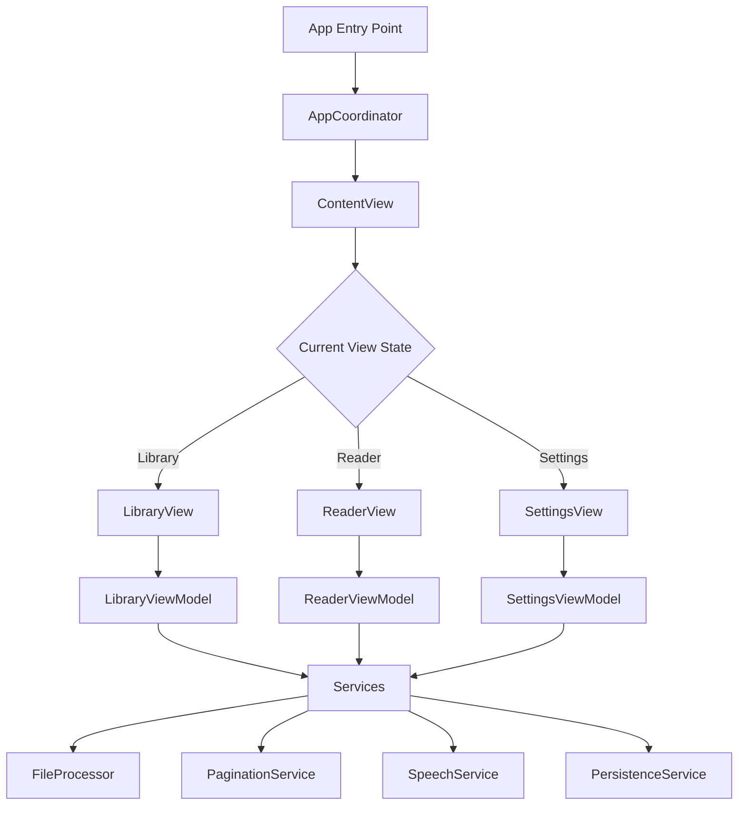

# Developer Guide - ReadAloudApp

## Project Overview

ReadAloudApp is a high-performance iOS application designed to read large text files with features including:
- Lazy pagination for efficient memory usage
- Text-to-speech with synchronized highlighting
- MVVM-C architecture for clean separation of concerns
- Support for very large files (up to 2GB)

## Architecture

### MVVM-C Pattern



### Core Components

1. **AppCoordinator**: Central navigation and dependency injection
2. **ViewModels**: Business logic and state management
3. **Views**: SwiftUI presentation layer
4. **Services**: Reusable business logic components
5. **Models**: Data structures (Codable, Identifiable)

## Development Setup

### Prerequisites

- macOS with Xcode 16.0 or later
- iOS 17.0+ deployment target
- Swift 5.10+

### Getting Started

1. Clone the repository
2. Navigate to `ReadAloudApp` directory
3. Open the Xcode project:
   ```bash
   cd ReadAloudApp
   open ReadAloudApp.xcodeproj
   ```
   
   Or if you need to regenerate the project:
   ```bash
   xcodegen generate
   open ReadAloudApp.xcodeproj
   ```

4. Select an iOS Simulator and press ⌘+R to run

### Project Structure

```
ReadAloudApp/
├── Sources/
│   └── ReadAloudApp/
│       ├── ReadAloudApp.swift          # App entry point
│       ├── Coordinators/               # Navigation logic
│       │   └── AppCoordinator.swift
│       ├── Views/                      # SwiftUI views
│       │   ├── ContentView.swift
│       │   ├── LibraryView.swift
│       │   ├── ReaderView.swift
│       │   └── SettingsView.swift
│       ├── ViewModels/                 # View logic
│       │   ├── LibraryViewModel.swift
│       │   ├── ReaderViewModel.swift
│       │   └── SettingsViewModel.swift
│       ├── Models/                     # Data models
│       │   └── Book.swift
│       ├── Services/                   # Business services
│       └── Resources/                  # Assets
├── Tests/
│   └── ReadAloudAppTests/
└── Package.swift                       # SPM configuration
```

## Key Implementation Details

### Navigation Flow

The AppCoordinator manages all navigation through published properties:
- `currentView`: Enum representing active screen
- `selectedBook`: Currently selected book for reading

### State Management

Each ViewModel is an `ObservableObject` with `@Published` properties for reactive UI updates.

### Bridging Header

`ReadAloudApp-Bridging-Header.h` is configured for Swift/Objective-C interoperability, supporting:
- Legacy code integration
- C/C++ library usage (via Objective-C++ wrappers)
- Performance-critical implementations

Example usage:
```objc
// In bridging header
#import "LegacyTextProcessor.h"

// In Swift code
let processor = LegacyTextProcessor()
let result = processor.processText("Hello")
```

The project includes `InteroperabilityService` demonstrating this capability.

## Coding Standards

### Swift Style Guide

- Use descriptive names for types, properties, and methods
- Follow Swift API Design Guidelines
- Use MARK comments to organize code sections
- Prefer value types (structs) over reference types when possible

### SwiftUI Best Practices

- Keep views simple and focused
- Extract complex views into separate components
- Use ViewModifiers for reusable styling
- Leverage @StateObject, @ObservedObject appropriately

### Error Handling

- Use custom AppError enum for domain-specific errors
- Handle errors at appropriate levels (ViewModel/Service)
- Provide user-friendly error messages

## Testing

Run tests using:
```bash
swift test
```

Or in Xcode: Product → Test (⌘U)

## Dependencies

Currently using only Apple frameworks. Future dependencies will be managed via Swift Package Manager.

## Performance Considerations

- File loading uses memory-mapping for files < 1.5GB
- Pagination calculations are cached
- UI updates are batched and performed on main thread
- Background queues used for heavy operations

## Future Enhancements

See `docs/project_context.md` for complete roadmap including:
- File processing with hybrid loading strategy
- Core Text pagination engine
- AVSpeechSynthesizer integration
- Persistence layer implementation 