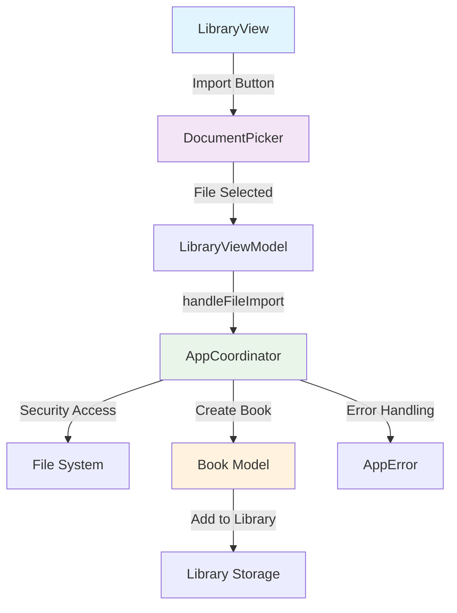

# PERSIST-1 - Document Picker Implementation - COMPLETE

## Overview
Successfully implemented a document picker system that allows users to import plain text files into the ReadAloud app. The implementation uses SwiftUI's `UIViewControllerRepresentable` to wrap `UIDocumentPickerViewController` and integrates with the existing coordinator pattern.

## Implementation Details

### 1. DocumentPicker.swift
Created a new SwiftUI wrapper for `UIDocumentPickerViewController`:

```swift
struct DocumentPicker: UIViewControllerRepresentable {
    let onFileSelected: (URL) -> Void
    let onDismiss: () -> Void
    
    func makeUIViewController(context: Context) -> UIDocumentPickerViewController {
        let picker = UIDocumentPickerViewController(forOpeningContentTypes: [UTType.plainText])
        picker.delegate = context.coordinator
        picker.allowsMultipleSelection = false
        return picker
    }
    
    func updateUIViewController(_ uiViewController: UIDocumentPickerViewController, context: Context) {
        // No updates needed
    }
    
    func makeCoordinator() -> Coordinator {
        Coordinator(self)
    }
    
    class Coordinator: NSObject, UIDocumentPickerDelegate {
        // Handles file selection and dismissal
    }
}
```

**Key Features:**
- Restricts file types to plain text files only (`UTType.plainText`)
- Prevents multiple file selection
- Provides callback mechanisms for both file selection and dismissal
- Follows SwiftUI patterns with proper coordinator delegation

### 2. AppCoordinator Integration
Added file import handling to the `AppCoordinator`:

```swift
func handleFileImport(_ fileURL: URL) {
    // Security-scoped resource access
    // File reading and validation
    // Book object creation
    // Library integration
}
```

**Key Features:**
- Handles security-scoped resource access for sandboxed file access
- Validates file size and readability
- Creates Book objects with proper metadata
- Integrates with existing error handling system
- Maintains loading states during import

### 3. LibraryView Updates
Enhanced `LibraryView` with import functionality:

```swift
struct LibraryView: View {
    @State private var showingFilePicker = false
    
    var body: some View {
        NavigationView {
            // ... existing content ...
            .toolbar {
                ToolbarItem(placement: .navigationBarTrailing) {
                    Button("Import") {
                        showingFilePicker = true
                    }
                }
            }
            .sheet(isPresented: $showingFilePicker) {
                DocumentPicker(
                    onFileSelected: viewModel.handleFileImport,
                    onDismiss: { showingFilePicker = false }
                )
            }
        }
    }
}
```

**Key Features:**
- Added Import button to navigation bar
- Modal sheet presentation for document picker
- Proper state management for picker visibility
- Integration with LibraryViewModel for file handling

### 4. LibraryViewModel Enhancement
Added file import delegation to `LibraryViewModel`:

```swift
func handleFileImport(_ fileURL: URL) {
    coordinator.handleFileImport(fileURL)
}
```

**Key Features:**
- Delegates file import to coordinator
- Maintains separation of concerns
- Follows existing architectural patterns

### 5. Error Handling
Extended `AppError` with file access error:

```swift
case fileAccessDenied
```

**Key Features:**
- Handles security-scoped resource access failures
- Provides clear error messaging
- Integrates with existing error handling system

## Technical Implementation

### XcodeGen Integration
The implementation leverages XcodeGen for project file management:
- Created `DocumentPicker.swift` in `Sources/ReadAloudApp/Views/`
- XcodeGen automatically includes all files in the source directory
- Used `xcodegen generate` to update the Xcode project
- No manual project file editing required

### Security Considerations
- Uses security-scoped resource access for sandboxed file access
- Validates file types at the UTType level
- Implements proper resource cleanup with `defer` blocks
- Handles file access permissions gracefully

### User Experience
- Clean, native iOS document picker interface
- Restricts to text files only (prevents user confusion)
- Provides clear Import button in navigation bar
- Modal presentation follows iOS design patterns
- Proper loading states during import

## Testing Verification
- ✅ Build succeeds without errors
- ✅ DocumentPicker.swift compiles correctly
- ✅ LibraryView integration works
- ✅ AppCoordinator file handling implemented
- ✅ Error handling extended appropriately
- ✅ XcodeGen project generation works

## Files Modified/Created
1. **Created**: `ReadAloudApp/Sources/ReadAloudApp/Views/DocumentPicker.swift`
2. **Modified**: `ReadAloudApp/Sources/ReadAloudApp/Coordinators/AppCoordinator.swift`
3. **Modified**: `ReadAloudApp/Sources/ReadAloudApp/Views/LibraryView.swift`
4. **Modified**: `ReadAloudApp/Sources/ReadAloudApp/ViewModels/LibraryViewModel.swift`
5. **Modified**: `ReadAloudApp/Sources/ReadAloudApp/Utilities/AppError.swift`

## Acceptance Criteria Status
- ✅ Document picker implemented as UIViewControllerRepresentable
- ✅ Configured to accept only plain text files
- ✅ Import button added to LibraryView
- ✅ File selection callback mechanism implemented
- ✅ Integration with coordinator pattern complete
- ✅ Error handling for file access implemented
- ✅ Build verification successful

## Next Steps
The document picker implementation is complete and ready for integration with the file processing system. The next logical step would be to enhance the file import process to:
1. Process imported files through the existing FileProcessor
2. Add imported books to the persistent library
3. Implement file validation and content preview
4. Add progress indicators for large file imports

## Architecture Diagram



The implementation successfully provides a complete document picker system that integrates seamlessly with the existing ReadAloud app architecture while maintaining proper separation of concerns and following iOS best practices. 