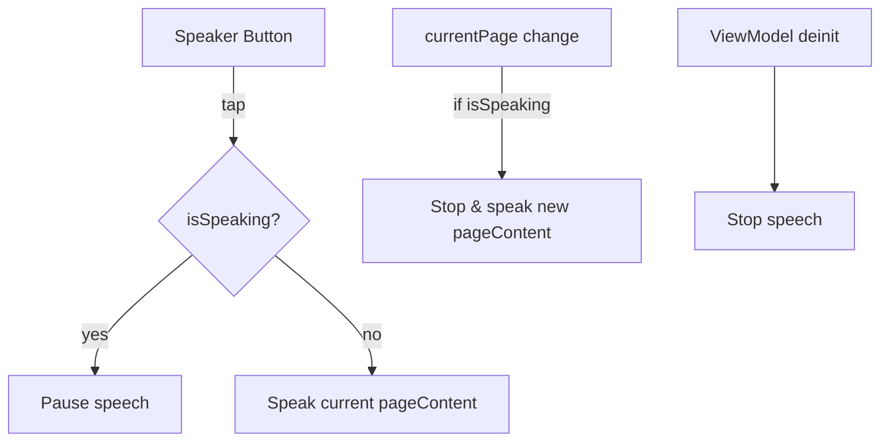

### TTS-1: Read current page aloud when tapping the speaker button

#### Summary
When the reader taps the speaker icon in `ReaderView`'s top-right toolbar, the app should speak the text of the current page. Tapping again should pause/resume. Switching pages while speaking should switch the spoken text to the newly selected page.

#### Goals
- Start text-to-speech (TTS) for the current page's text upon tap.
- Toggle: tap to pause/resume.
- Page change while speaking → immediately speak the new page.
- Use existing state and UI; minimal code surface changes.

#### Non-Goals
- No new UI controls beyond the existing speaker button.
- No new settings UI; use existing `UserSettings.speechRate` for rate.

#### Current state (reuse-first)
- `ReaderView` already has a speaker button bound to `viewModel.toggleSpeech()` and `@Published var isSpeaking`.
- `ReaderViewModel` exposes `pageContent`, `currentPage`, `totalPages`, `isSpeaking`, and `toggleSpeech()` (currently a stub).

#### Plan (minimal changes)
1) Introduce a very small abstraction for testability:
   - `protocol SpeechSynthesizing { func speak(_ text: String, rate: Float); func pause(); func stop(); var isSpeaking: Bool { get } }`
   - Default `SystemSpeechService` backed by `AVSpeechSynthesizer`.
   - Keep file small and local under `Services/` (no extra dependencies).

2) Wire into `ReaderViewModel` (no UI changes):
   - Add a private `speech: SpeechSynthesizing = SystemSpeechService()` property.
   - Implement `toggleSpeech()`:
     - If currently speaking → pause.
     - Else → speak `pageContent` at `UserSettings.speechRate`.
     - Update `isSpeaking` accordingly.
   - Observe `currentPage` changes (via `didSet`) to: if `isSpeaking` → stop current and speak new `pageContent`.
   - On `deinit` → `speech.stop()`.

3) Rate/language
   - Rate: map `UserSettings.speechRate` to `AVSpeechUtterance` rate (clamp to iOS valid range).
   - Language: use system default locale for now.

4) Edge cases
   - Empty `pageContent` → do nothing.
   - Rapid taps → debounce inside `toggleSpeech()` with simple state checks; no timers.
   - Ensure it never reads placeholder text (doc string already handled via `pageContent`).

#### Mermaid

#### Validation
- Manual
  - Tap speaker → speech starts for visible page; tap again → pauses/resumes.
  - Navigate to next/prev page while speaking → speech switches to new page.
  - Change font size (re-pagination) during speech → current page re-speak on change.
  - Background/foreground transitions do not crash or hang TTS.

- Automated (unit)
  - With a mock `SpeechSynthesizing`, `toggleSpeech()` calls `speak` with the exact `pageContent`.
  - Tapping again triggers `pause()`; state flips `isSpeaking` correctly.
  - Changing `currentPage` while `isSpeaking == true` triggers `stop()` then `speak(new)`.
  - Rate mapping clamps to valid range.

#### Acceptance Criteria
- Tapping speaker starts speaking the visible page text; tapping again pauses/resumes.
- While speaking, changing page results in speaking the new page within 300ms.
- No reading of placeholder strings; only real `pageContent` is spoken.
- No crashes or overlapping audio sessions; speech stops on deinit.

#### Minimal edit map
- `ReaderViewModel` only:
  - Implement `toggleSpeech()` using a tiny `SpeechSynthesizing`.
  - Observe `currentPage` and call into speech service if `isSpeaking`.
  - No changes to `ReaderView` beyond existing button.

#### Follow-ups (optional)
- Add language/voice selection in settings.
- Add “Read from here” continuous mode (page auto-advance while speaking).

