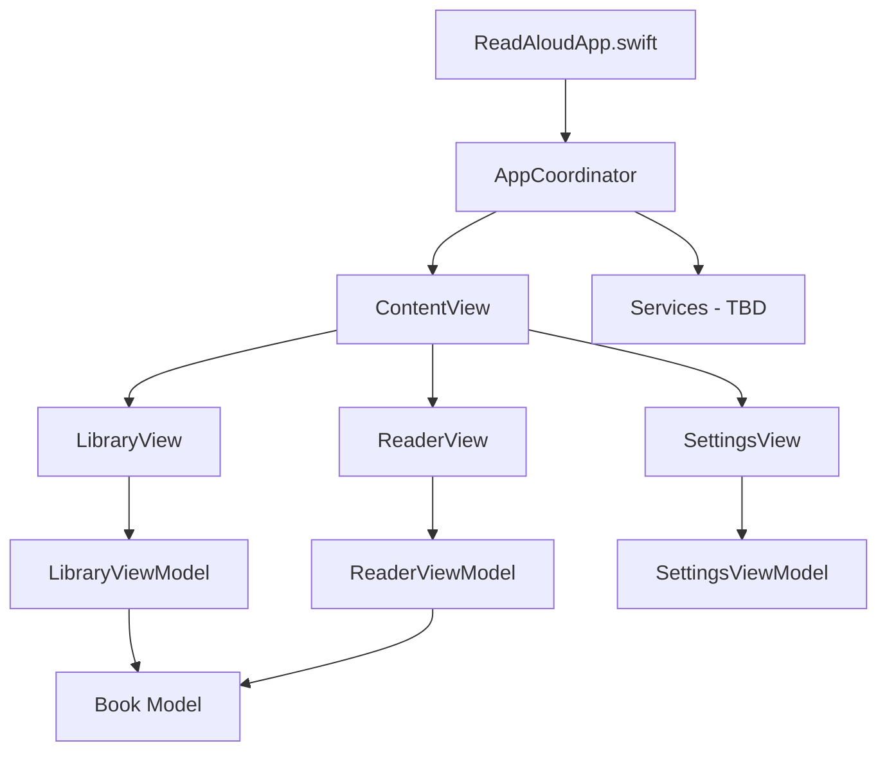

# CORE-1 Implementation Summary

## Task: Initialize Xcode Project and Configure Basic Settings

### Status: ✅ COMPLETE

### What Was Implemented

1. **Created Xcode Project Structure**
   - Project name: "ReadAloudApp"
   - Used Swift Package Manager structure
   - Configured for iOS 17.0+ deployment target
   - Set up as SwiftUI app with SwiftUI App lifecycle

2. **MVVM-C Architecture Implementation**
   - Created folder structure:
     - `Coordinators/` - Contains AppCoordinator for navigation
     - `Views/` - SwiftUI views (ContentView, LibraryView, ReaderView, SettingsView)
     - `ViewModels/` - Business logic (LibraryViewModel, ReaderViewModel, SettingsViewModel)
     - `Models/` - Data models (Book struct)
     - `Services/` - Placeholder for future services
     - `Resources/` - App resources including Info.plist

3. **Core Components Created**
   - **AppCoordinator**: Central navigation and dependency injection
   - **ContentView**: Root view managing screen transitions
   - **LibraryView**: Book collection display with empty state
   - **ReaderView**: Paginated reader with TabView implementation
   - **SettingsView**: User preferences for text and speech
   - **Book Model**: Core data structure with all required properties

4. **Bridging Header**
   - Created `ReadAloudApp-Bridging-Header.h` for Objective-C interoperability
   - Enables future integration with C/C++ libraries or legacy Objective-C code

5. **Project Configuration**
   - Package.swift configured with iOS and macOS platforms
   - Test target created with basic Book model test
   - Info.plist created for iOS app configuration

### How to Open the Project

```bash
cd ReadAloudApp
open -a Xcode Package.swift
```

### Architecture Diagram



### Next Steps

With CORE-1 complete, the project now has:
- ✅ A clean Xcode project structure
- ✅ SwiftUI interface configured
- ✅ MVVM-C pattern established
- ✅ iOS 17+ deployment target
- ✅ Bridging header for future Objective-C integration

The project is ready for CORE-2 implementation, which will enhance the MVVM-C structure and implement proper navigation flows. 