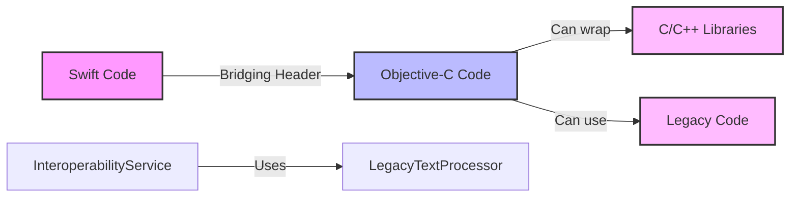

# CORE-2 Implementation Summary

## Task: Establish Swift/Objective-C Interoperability

### Status: ✅ COMPLETE

### What Was Implemented

1. **Bridging Header Configuration**
   - `ReadAloudApp-Bridging-Header.h` was already created in CORE-1
   - Verified it's properly configured in `project.yml` with `SWIFT_OBJC_BRIDGING_HEADER` setting
   - Added import statement for demonstration Objective-C class

2. **Demonstration Objective-C Classes**
   - Created `LegacyTextProcessor.h/.m` to demonstrate Objective-C integration
   - Implements text processing and hashing methods using C-style code
   - Shows how legacy algorithms or C/C++ code can be wrapped in Objective-C

3. **Swift Integration**
   - Created `InteroperabilityService.swift` that uses the Objective-C class
   - Demonstrates seamless method calls from Swift to Objective-C
   - Shows type conversion between Swift String and NSString

4. **Comprehensive Testing**
   - Added 6 unit tests in `InteroperabilityTests.swift`
   - All tests pass, verifying:
     - Objective-C classes can be instantiated from Swift
     - Methods can be called across language boundaries
     - Type conversions work correctly
     - Edge cases are handled properly

5. **Build Configuration**
   - Updated test target configuration to generate Info.plist
   - Project builds successfully with mixed Swift/Objective-C code
   - No compilation errors or warnings

### Test Results

```
Test Suite 'InteroperabilityTests' passed
Executed 6 tests, with 0 failures in 0.004 seconds
```

### Architecture Benefits



### How to Use the Bridging Header

1. **Adding Objective-C code to Swift project:**
   ```objc
   // In ReadAloudApp-Bridging-Header.h
   #import "YourObjectiveCClass.h"
   ```

2. **Using from Swift:**
   ```swift
   let objcInstance = YourObjectiveCClass()
   let result = objcInstance.someMethod()
   ```

3. **For C++ integration:**
   - Create Objective-C++ wrapper (.mm file)
   - Import C++ headers in .mm file
   - Expose Objective-C interface in .h file
   - Import .h file in bridging header

### Future Use Cases

With this interoperability established, the project can now:
- ✅ Integrate performance-critical C++ code for text processing
- ✅ Use existing Objective-C libraries without rewriting
- ✅ Leverage C libraries for low-level operations
- ✅ Maintain backward compatibility with legacy code

The foundation is now set for seamless mixed-language development as mentioned in the project requirements. 