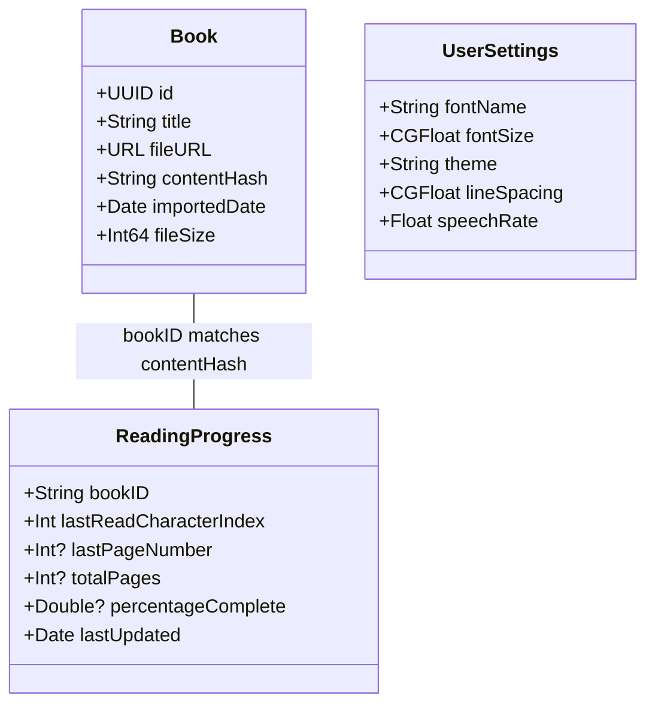

# CORE-3 Implementation Summary

## Task: Define Core Data Models

### Status: ✅ COMPLETE

### What Was Implemented

1. **Book Model** (Already existed from CORE-1)
   - ✅ Properties: `id: UUID`, `title: String`, `fileURL: URL`, `contentHash: String`
   - ✅ Additional properties: `importedDate: Date`, `fileSize: Int64`
   - ✅ Conforms to: `Identifiable`, `Codable`, `Hashable`
   - ✅ Contains no business logic

2. **UserSettings Model** (New)
   - ✅ Properties: `fontName: String`, `fontSize: CGFloat`, `theme: String`, `lineSpacing: CGFloat`, `speechRate: Float`
   - ✅ Conforms to: `Codable`
   - ✅ Default values provided for all properties
   - ✅ Static properties for available options and ranges
   - ✅ Contains no business logic

3. **ReadingProgress Model** (New)
   - ✅ Properties: `bookID: String`, `lastReadCharacterIndex: Int`
   - ✅ Additional properties: `lastPageNumber`, `totalPages`, `percentageComplete`, `lastUpdated`
   - ✅ Conforms to: `Codable`
   - ✅ Helper methods for common operations
   - ✅ Contains no business logic (only data transformation)

### Additional Improvements

1. **Updated SettingsViewModel** to use the new `UserSettings` model
2. **Updated SettingsView** to bind to the model properties
3. **Created comprehensive unit tests** - 12 tests, all passing

### Test Results

```
Test Suite 'ModelTests' passed
Executed 12 tests, with 0 failures in 0.012 seconds
```

### Architecture Benefits



### Model Usage Examples

```swift
// Creating a book
let book = Book(
    title: "My Book",
    fileURL: URL(fileURLWithPath: "/path/to/book.txt"),
    contentHash: "abc123"
)

// User settings with defaults
let settings = UserSettings.default

// Tracking reading progress
var progress = ReadingProgress.beginning(for: book.contentHash)
progress.updatePosition(characterIndex: 1000, pageNumber: 10, totalPages: 100)
```

### Key Design Decisions

1. **Plain structs with no business logic** - Keeps models pure and testable
2. **Codable conformance** - Easy persistence and serialization
3. **Identifiable for Book** - SwiftUI list compatibility
4. **Content hash as book ID** - Ensures progress tracks content, not filename
5. **Default values** - Convenient initialization
6. **Helper extensions** - Common operations without business logic

All models are now ready for use throughout the application, providing a solid foundation for data management. 