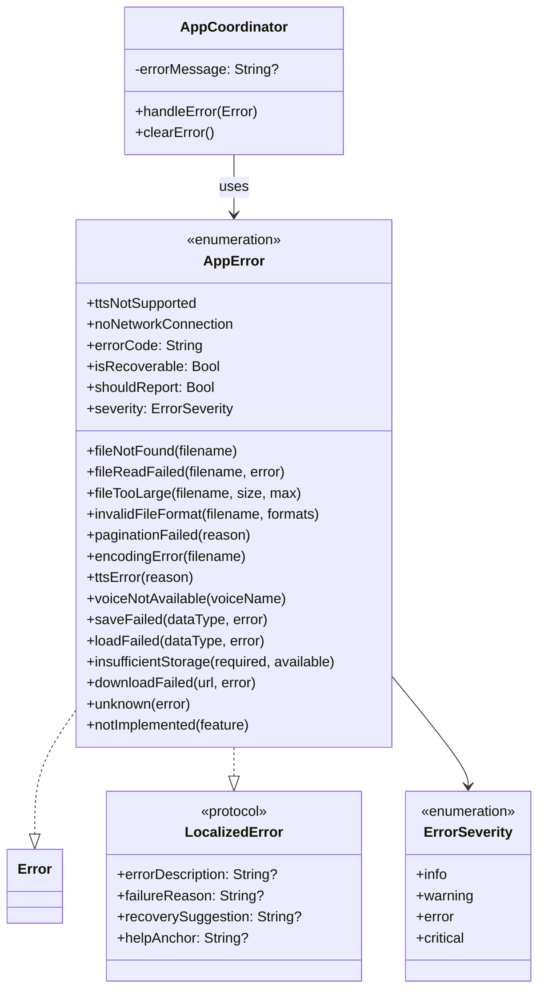

# CORE-5: Implement Centralized Error Handling - Completion Summary

## Ticket: CORE-5
**Status:** ✅ Complete  
**Completed:** 2025-01-08

## Overview
Established a centralized and consistent error handling strategy by creating a custom AppError enum that provides clear, domain-specific error information throughout the application.

## Implementation Details

### 1. Created AppError Enum (AppError.swift)
Located in `ReadAloudApp/Sources/ReadAloudApp/Utilities/AppError.swift`

#### Core Features:
- **Error Protocol Conformance**: Conforms to `Error` and `LocalizedError` protocols
- **Domain-Specific Cases**: Organized into logical categories
- **User-Friendly Messages**: Each error provides clear, actionable descriptions
- **Comprehensive Metadata**: Error codes, severity levels, recovery suggestions

#### Error Categories Implemented:

##### File Operation Errors
- `fileNotFound(filename: String)` - FILE_001
- `fileReadFailed(filename: String, underlyingError: Error?)` - FILE_002
- `fileTooLarge(filename: String, sizeInMB: Double, maxSizeInMB: Double)` - FILE_003
- `invalidFileFormat(filename: String, expectedFormats: [String])` - FILE_004

##### Text Processing Errors
- `paginationFailed(reason: String)` - TEXT_001
- `encodingError(filename: String)` - TEXT_002

##### Text-to-Speech Errors
- `ttsError(reason: String)` - TTS_001
- `voiceNotAvailable(voiceName: String)` - TTS_002
- `ttsNotSupported` - TTS_003

##### Storage Errors
- `saveFailed(dataType: String, underlyingError: Error?)` - STORAGE_001
- `loadFailed(dataType: String, underlyingError: Error?)` - STORAGE_002
- `insufficientStorage(requiredMB: Double, availableMB: Double)` - STORAGE_003

##### Network Errors
- `noNetworkConnection` - NET_001
- `downloadFailed(url: String, underlyingError: Error?)` - NET_002

##### General Errors
- `unknown(underlyingError: Error?)` - GEN_001
- `notImplemented(feature: String)` - GEN_002

### 2. LocalizedError Protocol Implementation
Each error provides:
- **errorDescription**: User-friendly error message
- **failureReason**: Technical explanation of what failed
- **recoverySuggestion**: Actionable steps for the user
- **helpAnchor**: Documentation reference for help system

### 3. Additional Error Properties
- **errorCode**: Unique identifier for logging and debugging
- **isRecoverable**: Indicates if the error can be resolved by user action
- **shouldReport**: Whether to send to analytics/crash reporting
- **severity**: ErrorSeverity enum (info, warning, error, critical)

### 4. AppCoordinator Integration
Updated `AppCoordinator.handleError()` to:
- Convert generic errors to AppError when possible
- Use AppError's localized descriptions
- Include error codes in debug logging
- Maintain backward compatibility with generic errors

### 5. Test Coverage
Created comprehensive AppErrorTests.swift with 20 test cases:
- Individual error case testing
- LocalizedError property verification
- Error code uniqueness validation
- AppCoordinator integration testing
- All tests passing ✅

## Mermaid Diagram

## Files Modified/Created
1. **Created**: `ReadAloudApp/Sources/ReadAloudApp/Utilities/AppError.swift`
2. **Modified**: `ReadAloudApp/Sources/ReadAloudApp/Coordinators/AppCoordinator.swift`
3. **Created**: `ReadAloudApp/Tests/ReadAloudAppTests/AppErrorTests.swift`
4. **Updated**: `CHANGELOG.md`

## Acceptance Criteria Met
✅ AppError.swift file created in Utilities group  
✅ AppError enum conforms to Error and LocalizedError protocols  
✅ Initial cases implemented (fileNotFound, fileReadFailed, paginationFailed, ttsError)  
✅ Each case provides user-friendly errorDescription  
✅ Additional error cases added for comprehensive coverage  
✅ Integration with existing error handling infrastructure  
✅ Comprehensive test coverage (20 tests)  

## Benefits
1. **Consistency**: All errors follow the same pattern and provide consistent information
2. **User Experience**: Clear, actionable error messages improve usability
3. **Debugging**: Error codes and metadata simplify troubleshooting
4. **Extensibility**: Easy to add new error cases as the app grows
5. **Type Safety**: Compile-time guarantees for error handling
6. **Analytics Ready**: Built-in support for error reporting and severity levels

## Next Steps
- Integrate AppError throughout the codebase as features are implemented
- Add localization support for error messages
- Implement error analytics/reporting service integration
- Create user-facing error dialogs that leverage the recovery suggestions

This completes the CORE-5 implementation with a robust, extensible error handling system that will serve as the foundation for all error management in the ReadAloudApp. 