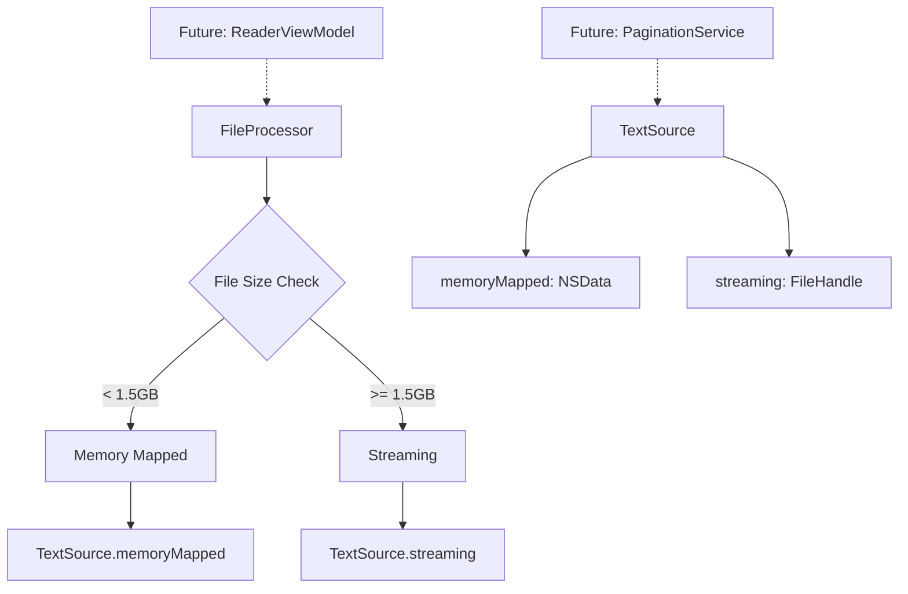

# FILE-1: Create FileProcessor Service and TextSource Abstraction

## Summary
Successfully implemented the foundational components for file handling in the ReadAloudApp. Created a FileProcessor service to encapsulate file I/O logic and defined a TextSource type as an abstraction layer for loaded text data.

## Implementation Details

### 1. TextSource Type
Created an enum with two cases to represent different file loading strategies:
- `memoryMapped(NSData)` - For files < 1.5GB, using memory-mapped I/O for optimal performance
- `streaming(FileHandle)` - For very large files (>= 1.5GB), using streaming to avoid iOS virtual memory limits

### 2. FileProcessor Service
Implemented the FileProcessor class with:
- Public async method: `func loadText(from url: URL) async throws -> TextSource`
- Memory map threshold constant: 1.5GB
- Initial stub implementation throwing `AppError.notImplemented`

### 3. Architecture Overview

### 4. Test Coverage
Created comprehensive tests for both FileProcessor and TextSource:
- FileProcessor initialization test
- Async method signature verification
- NotImplemented error handling test
- TextSource enum case tests for both memory-mapped and streaming variants
- Total: 6 new tests, all passing

## Files Created/Modified

1. **Created**: `ReadAloudApp/Sources/ReadAloudApp/Services/FileProcessor.swift`
   - Defined TextSource enum
   - Implemented FileProcessor class with stub loadText method

2. **Created**: `ReadAloudApp/Tests/ReadAloudAppTests/FileProcessorTests.swift`
   - Comprehensive test suite with 6 tests

3. **Fixed**: Updated `NSFileHandle` references to `FileHandle` (Swift naming convention)

## Acceptance Criteria Met ✅

1. ✅ A new file FileProcessor.swift is created within the Services project group
2. ✅ A TextSource type is defined to represent the loaded text data source
3. ✅ The FileProcessor class is created with a public, asynchronous method signature: `func loadText(from url: URL) async throws -> TextSource`
4. ✅ The initial implementation of loadText(from:) is a stub that throws a notImplemented error

## Integration Points

This implementation provides the foundation for:
- FILE-2: Implementing the hybrid file reading strategy
- FILE-3: Content hashing for unique book identification
- Future pagination and reader services that will consume TextSource

## Technical Notes

- Used Swift's modern concurrency with async/await for the loadText method
- Chose enum over protocol for TextSource to provide a finite set of loading strategies
- Included the memory threshold constant (1.5GB) based on iOS virtual memory limits documented in project context
- All code follows MVVM-C architecture patterns established in the project

## Test Results
- Total project tests: 56 (was 50, added 6)
- All tests passing ✅
- No failures or warnings 