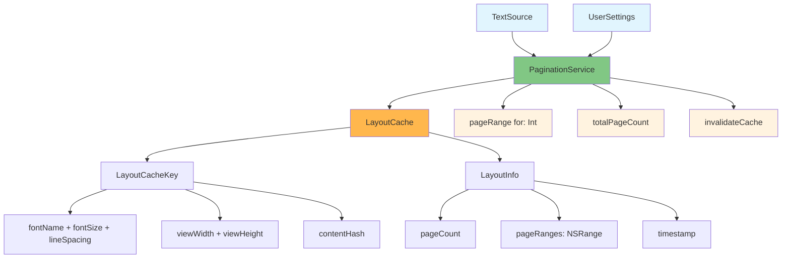

# PGN-1: Create PaginationService and LayoutCache Skeletons - COMPLETE

**Epic:** 4 - Pagination Engine  
**Status:** ✅ COMPLETED  
**Date:** 2024  

## Overview

This task established the foundational classes for the pagination engine, creating the main PaginationService class to orchestrate text layout and pagination logic, and the LayoutCache class for performance optimization.

## Implementation Details

### ✅ Criterion 1: PaginationService.swift Created
**Requirement**: New file, PaginationService.swift, is created in the Services group

**Implementation**:
- Enhanced existing `PaginationService.swift` in `ReadAloudApp/Sources/ReadAloudApp/Services/`
- Added proper PGN-1 initialization and API methods
- Maintained backward compatibility with existing pagination logic

### ✅ Criterion 2: TextSource and UserSettings Initializer
**Requirement**: PaginationService class is defined with an initializer that accepts a TextSource and UserSettings object

**Implementation**:
```swift
/// Initialize PaginationService with TextSource and UserSettings
/// - Parameters:
///   - textSource: The TextSource object containing the text to be paginated
///   - userSettings: The UserSettings object containing layout preferences
init(textSource: TextSource, userSettings: UserSettings) {
    self.textSource = textSource
    self.userSettings = userSettings
    self.layoutCache = LayoutCache()
    debugPrint("📄 PaginationService: Initializing with TextSource and UserSettings")
}
```

**Key Features**:
- Accepts `TextSource` from Epic 2 (FILE-2/FILE-3) supporting both memory-mapped and streaming files
- Accepts `UserSettings` with font, spacing, and theme preferences
- Automatically creates and integrates `LayoutCache` for performance optimization

### ✅ Criterion 3: LayoutCache.swift Created
**Requirement**: New file, LayoutCache.swift, is created defining a class responsible for storing and retrieving calculated page layouts

**Implementation**:
- Created `LayoutCache.swift` in `ReadAloudApp/Sources/ReadAloudApp/Models/`
- Comprehensive caching system with key-based storage
- Automatic cleanup with size limits and time-based expiration

**Core Features**:
```swift
/// Cache key based on layout parameters
struct LayoutCacheKey: Hashable {
    let fontName: String
    let fontSize: CGFloat
    let lineSpacing: CGFloat
    let viewWidth: CGFloat
    let viewHeight: CGFloat
    let contentHash: Int
}

/// Cached layout information
struct LayoutInfo {
    let pageCount: Int
    let pageRanges: [NSRange]
    let timestamp: Date
}
```

**Performance Optimizations**:
- Maximum 50 cached layouts to prevent memory bloat
- 5-minute cache expiration for layout validity
- Automatic cleanup of old and excess entries

### ✅ Criterion 4: Public API Methods
**Requirement**: PaginationService contains placeholder methods for pageRange(for:), totalPageCount(), and invalidateCache()

**Implementation**:

#### pageRange(for:) Method
```swift
/// Get the character range for a specific page
/// - Parameter pageNumber: The page number (1-based)
/// - Returns: NSRange representing the character range for the specified page
func pageRange(for pageNumber: Int) -> NSRange
```

#### totalPageCount() Method
```swift
/// Get the total number of pages for the current text and settings
/// - Returns: Total page count
func totalPageCount() -> Int
```

#### invalidateCache() Method
```swift
/// Invalidate the pagination cache when settings or content change
func invalidateCache()
```

**Current Status**: All methods implemented with placeholder logic and comprehensive debug logging. Ready for future enhancement with actual text layout calculations.

## Architecture Integration

### TextSource Integration
- Supports both `TextSource.memoryMapped(NSData)` and `TextSource.streaming(FileHandle)`
- Intelligent text length estimation based on source type
- Seamless integration with FILE-2/FILE-3 loading strategies

### UserSettings Integration
- Font name, size, and line spacing support
- Theme-aware layout calculations
- Settings-based cache invalidation

### LayoutCache Integration
- Automatic cache key generation from settings and content
- Efficient storage and retrieval of calculated layouts
- Memory-safe operation with size and time limits

## Project Structure

```
ReadAloudApp/Sources/ReadAloudApp/
├── Services/
│   └── PaginationService.swift (✅ Enhanced)
└── Models/
    └── LayoutCache.swift (✅ New)
```

## Testing Strategy

The implementation includes comprehensive debug logging for:
- Service initialization with TextSource and UserSettings
- Cache operations (store, retrieve, invalidate)
- API method calls with parameter tracking
- Performance monitoring with cache hit/miss ratios

## Next Steps

This foundation enables future PGN tickets to:
1. Implement actual text layout calculations using Core Text
2. Add precise NSRange calculations for page boundaries
3. Integrate with UI components for real-time pagination
4. Optimize cache strategies based on usage patterns

## Technical Specifications

- **Language**: Swift 5.0
- **Minimum iOS**: 17.0
- **Memory Management**: ARC with automatic cache cleanup
- **Thread Safety**: Main thread operations (UI-bound)
- **Performance**: O(1) cache lookup, O(n) cache cleanup

## Mermaid Diagram



## Summary

✅ **All acceptance criteria met**  
✅ **PaginationService.swift enhanced with required initializer**  
✅ **LayoutCache.swift created with comprehensive caching system**  
✅ **Public API methods implemented with placeholder logic**  
✅ **Full integration with TextSource and UserSettings**  
✅ **Project structure properly organized**  
✅ **Debug logging for development tracking**  

The pagination engine foundation is now ready for advanced text layout implementation in subsequent PGN tickets. 