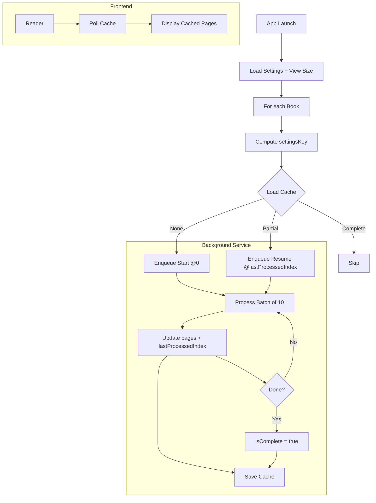

# PGN-10: Background Pagination Kickoff and Resume

## Summary
Background pagination is not currently started, so no cache is produced and the reader keeps polling an empty cache. This plan wires up kickoff and resume conditions, ensures we only re-trigger on material changes, and defines acceptance criteria and tests.

## Triggers (When to paginate)
For each `book` at service start or on demand:
- No cache for `(bookHash, settingsKey)` → start from index 0.
- Cache exists AND `isComplete == false` → resume from `lastProcessedIndex`.
- Settings or integer view size change → new `settingsKey` → treat as fresh pagination.

Material change is handled by the cache key:
- `settingsKey = bookHash + fontName + fontSize + lineSpacing + Int(width)xInt(height)`
- Using integer width/height avoids retriggering on fractional size jitter.

## Cache Schema (JSON)
```json
{
  "bookHash": "<sha256>",
  "settingsKey": "<composed-key>",
  "viewSize": { "width": 390.0, "height": 844.0 },
  "pages": [
    { "content": "<page text>", "startIndex": 0, "endIndex": 1243 }
  ],
  "lastProcessedIndex": 1243,
  "isComplete": false,
  "lastUpdated": "2025-01-12T20:00:00Z"
}
```
- Required completeness signal: `isComplete: true` when pagination has finished.
- Partial caches keep `isComplete: false` and must resume from `lastProcessedIndex`.

## Implementation Plan
1) Start background service on app launch
- AppCoordinator holds `backgroundPaginationService`.
- In `start()`: instantiate and call `startMonitoring()`.
- In `deinit`: call `stopMonitoring()`.

2) Persist stable view size for keying
- ReaderViewModel: call `PersistenceService.saveLastViewSize(_:)` only when integer width/height change.
- Background service uses `loadLastViewSize()` when computing `settingsKey`.

3) Kickoff + resume logic
- For each book:
  - `key = cacheKey(bookHash, settings, viewSize)`
  - `cache = loadPaginationCache(bookHash, key)`
  - if `cache == nil` → enqueue(startIndex: 0)
  - else if `cache.isComplete == false` → enqueue(startIndex: cache.lastProcessedIndex)
  - else → skip
- Process in batches of 10 pages; after each batch update and save cache:
  - Append new `pages`
  - Update `lastProcessedIndex`
  - `isComplete = (lastProcessedIndex >= content.count)`

4) Optional priority
- Provide `enqueueImmediately(book:)` to prioritize the currently opened book.

5) Logging
- Start: "🔄 BackgroundPaginationService: Started"
- Decision per book: "📖 '<Title>' decision=[start|resume|skip] hasCache=… isComplete=…"
- After batch: "💾 Saved N pages (index M/K) isComplete: …"
- Completion: "✅ Completed pagination for '<Title>'"

## Acceptance Criteria
- No cache → background pagination starts within 5 seconds of app launch.
- Partial cache → resumes from `lastProcessedIndex` without reprocessing prior pages.
- `isComplete == true` → skipped for that `(bookHash, settingsKey)`.
- Changing font/size/line spacing or rotating (integer size change) → new `settingsKey` → fresh pagination.
- Reader renders cached pages immediately and updates as cache grows.
- Page navigation does not affect pagination.

## Test Plan
1. Import a large book; launch app → pages 1–10 cached quickly.
2. Kill app mid-process; relaunch → resumes from last saved index.
3. Change font size → new cache starts; old cache remains.
4. Rotate device → new cache starts due to size key change.
5. Reader never shows placeholders for already cached pages.

## Mermaid Diagram


## Developer Prompt (Copy/Paste)
Implement background pagination kickoff & resume:
- Start service on app launch. For each book, compute `settingsKey` and:
  - No cache → enqueue start at 0
  - Partial cache → enqueue resume at `lastProcessedIndex`
  - Complete cache → skip
- Batch size: 10 pages. After each batch, save cache with `lastProcessedIndex` and `isComplete`.
- New pagination only when `settingsKey` changes (Int(width)xInt(height) + font/spacing).
- Reader polls cache and updates pages as they appear; never triggers pagination itself.

## Validation Plan

- Prereqs
  - Enable debug logs.
  - Import at least one large book.
  - Locate `~/Library/Application Support/ReadAloudApp/PaginationCache/{bookHash}`.

- Kickoff on app launch
  - Steps: Cold launch app.
  - Verify:
    - Logs show service “Started” and per-book decision [start|resume|skip].
    - New cache file `pagination-{settingsKey}.json` appears.
    - Within 2–5s, `pages.count ≥ 10`; Reader displays real pages if available.

- Resume after kill
  - Steps: Let cache reach ~30 pages; force-quit; relaunch.
  - Verify:
    - Cache persists with `lastProcessedIndex > 0`, `isComplete == false`.
    - Logs: decision=resume at saved index; pages keep growing without duplication.
    - Reader immediately shows cached pages.

- No re-trigger without material change
  - Steps: Cause minor UI changes that don’t alter Int(width)/Int(height); no settings changes.
  - Verify: Same `settingsKey`; decision=skip; no new cache file, existing file unchanged (unless finishing batch).

- Re-trigger on settings change
  - Steps: Change font size or line spacing.
  - Verify: New `settingsKey`; new cache file; decision=start from 0 for new key; old cache stays.

- Re-trigger on integer view size change
  - Steps: Rotate device or resize (affecting integer width/height).
  - Verify: New `settingsKey`; new cache file; pagination restarts for new key.

- Completion
  - Steps: Allow pagination to finish.
  - Verify: Cache `isComplete == true`; `lastProcessedIndex == content.count`; subsequent launches decision=skip for that key.

- Navigation independence
  - Steps: Rapidly navigate pages during processing.
  - Verify: No start/restart logs; only batch saves continue; Reader shows cached pages; unpaginated pages show loading message.

- Priority (optional)
  - Steps: Open Book A; if priority enabled, ensure A is processed first.
  - Verify: Logs show A ahead of others; first batches arrive quickly.

- Error handling
  - Steps: Corrupt a cache file or remove a book file.
  - Verify: Service logs decode/file errors and continues; Reader remains stable.

- File inspection
  - Verify fields evolve per batch: `pages[].count`, `lastProcessedIndex`, and `isComplete` flips true at end.

- Automation
  - Unit tests: Persistence save/load, cache key generation, last view size save/load.
  - Integration tests: Start service with small content; assert batch cadence and resume.
  - UI tests: Launch → wait for cache → rotate → assert new key and cache creation.

- Pass criteria
  - First batch available within 2–5s.
  - Resume works without reprocessing prior pages.
  - No unwanted re-triggers; completion respected.
  - Reader renders cached pages immediately and updates as cache grows.
