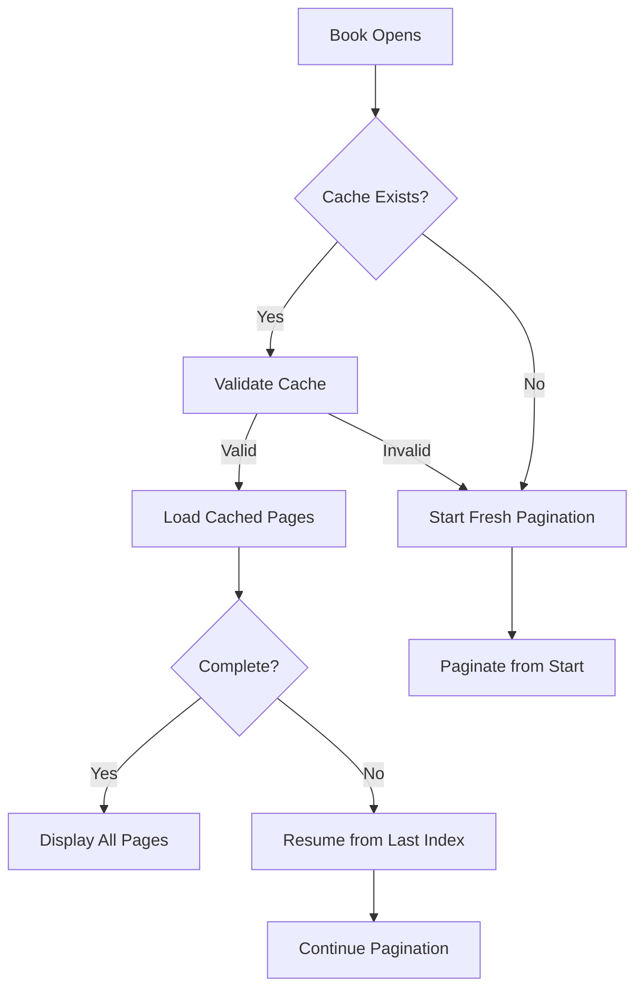

# PGN-8: Incremental Pagination with Progressive Page Delivery

## Feature Description

Implement incremental pagination that delivers accurate page ranges every 10 pages, with persistent storage of pagination results. This allows users to read with perfect pagination immediately while background processing continues, and enables resuming pagination from where it left off on subsequent opens.

## Current Problem

1. **All-or-Nothing Approach**: Current implementation waits for entire book to be paginated
2. **Estimated Content**: Users see imperfect page breaks until full pagination completes
3. **Wasted Time**: Users typically read sequentially but wait for pages they won't access immediately
4. **Poor UX**: Placeholder or estimated content shown instead of accurate pages
5. **Repeated Work**: Pagination restarts from scratch every time a book is opened
6. **Lost Progress**: If app closes during pagination, all work is lost

## Proposed Solution

### Incremental Pagination Strategy

```
Page 1-10: Process first (1-2 seconds) → Deliver to UI
Page 11-20: Process next batch → Update UI
Page 21-30: Continue in background → Update UI
... continues until book end
```

### Benefits

1. **Immediate Accuracy**: First 10 pages have perfect pagination within seconds
2. **Progressive Enhancement**: More pages become accurate as user reads
3. **Better Performance**: UI updates frequently with real results
4. **No Placeholders**: Always show accurately paginated content
5. **Persistent Cache**: Pagination results saved and reused across sessions
6. **Resume Capability**: Continue pagination from where it left off
7. **Instant Open**: Previously paginated books open instantly with cached results

## Technical Design

### 1. Pagination Cache Model

```swift
struct PaginationCache: Codable {
    let bookHash: String
    let settingsKey: String
    let viewSize: CGSize
    let pages: [PageRange]
    let lastProcessedIndex: Int
    let isComplete: Bool
    let lastUpdated: Date
    
    struct PageRange: Codable {
        let content: String
        let startIndex: Int
        let endIndex: Int
    }
    
    /// Generate cache key from book and settings
    static func cacheKey(bookHash: String, settings: UserSettings, viewSize: CGSize) -> String {
        let components = [
            bookHash,
            settings.fontName,
            "\(settings.fontSize)",
            "\(settings.lineSpacing)",
            "\(Int(viewSize.width))x\(Int(viewSize.height))"
        ]
        return components.joined(separator: "-")
    }
}

// Extension to PersistenceService
extension PersistenceService {
    func savePaginationCache(_ cache: PaginationCache) async throws {
        let encoder = JSONEncoder()
        let data = try encoder.encode(cache)
        let fileName = "pagination-\(cache.settingsKey).json"
        let url = documentsDirectory.appendingPathComponent("PaginationCache/\(cache.bookHash)/\(fileName)")
        
        try FileManager.default.createDirectory(
            at: url.deletingLastPathComponent(),
            withIntermediateDirectories: true
        )
        try data.write(to: url)
    }
    
    func loadPaginationCache(bookHash: String, settingsKey: String) async throws -> PaginationCache? {
        let fileName = "pagination-\(settingsKey).json"
        let url = documentsDirectory.appendingPathComponent("PaginationCache/\(bookHash)/\(fileName)")
        
        guard FileManager.default.fileExists(atPath: url.path) else { return nil }
        
        let data = try Data(contentsOf: url)
        let decoder = JSONDecoder()
        return try decoder.decode(PaginationCache.self, from: data)
    }
    
    func clearPaginationCache(for bookHash: String) async throws {
        let url = documentsDirectory.appendingPathComponent("PaginationCache/\(bookHash)")
        try? FileManager.default.removeItem(at: url)
    }
}
```

### 2. PaginationService Changes

```swift
protocol PaginationDelegate: AnyObject {
    func paginationService(_ service: PaginationService, 
                          didPaginatePages pages: [String], 
                          startingAt pageIndex: Int)
    func paginationServiceDidComplete(_ service: PaginationService)
}

class PaginationService {
    weak var delegate: PaginationDelegate?
    private let batchSize = 10
    private let persistenceService: PersistenceService
    private let bookHash: String
    
    init(bookHash: String, persistenceService: PersistenceService) {
        self.bookHash = bookHash
        self.persistenceService = persistenceService
    }
    
    func paginateIncrementally(content: String, 
                              settings: UserSettings, 
                              viewSize: CGSize,
                              existingCache: PaginationCache? = nil) async {
        
        var currentIndex = existingCache?.lastProcessedIndex ?? 0
        var pageIndex = existingCache?.pages.count ?? 0
        var batch: [String] = []
        var allPages: [PaginationCache.PageRange] = existingCache?.pages ?? []
        
        // Load existing pages if resuming
        if let cache = existingCache {
            await MainActor.run {
                let cachedPageContents = cache.pages.map { $0.content }
                delegate?.paginationService(self, 
                                          didPaginatePages: cachedPageContents, 
                                          startingAt: 0)
            }
        }
        
        while currentIndex < content.count {
            // Calculate next page using Core Text
            let pageRange = calculateNextPage(from: currentIndex, 
                                            in: viewSize, 
                                            with: settings)
            
            let pageContent = extractContent(from: content, 
                                           range: pageRange)
            
            let pageRangeData = PaginationCache.PageRange(
                content: pageContent,
                startIndex: currentIndex,
                endIndex: pageRange.upperBound
            )
            
            batch.append(pageContent)
            allPages.append(pageRangeData)
            
            // Deliver batch when ready
            if batch.count >= batchSize || 
               currentIndex >= content.count {
                await MainActor.run {
                    delegate?.paginationService(self, 
                                              didPaginatePages: batch, 
                                              startingAt: pageIndex)
                }
                
                // Save progress to cache
                let cache = PaginationCache(
                    bookHash: bookHash,
                    settingsKey: PaginationCache.cacheKey(
                        bookHash: bookHash,
                        settings: settings,
                        viewSize: viewSize
                    ),
                    viewSize: viewSize,
                    pages: allPages,
                    lastProcessedIndex: pageRange.upperBound,
                    isComplete: currentIndex >= content.count,
                    lastUpdated: Date()
                )
                
                try? await persistenceService.savePaginationCache(cache)
                
                pageIndex += batch.count
                batch.removeAll()
            }
            
            currentIndex = pageRange.upperBound
        }
        
        await MainActor.run {
            delegate?.paginationServiceDidComplete(self)
        }
    }
}
```

### 3. ReaderViewModel Updates

```swift
class ReaderViewModel: ObservableObject, PaginationDelegate {
    @Published var bookPages: [String] = []
    @Published var isPaginationComplete = false
    @Published var paginatedPageCount = 0
    
    private var paginationService: PaginationService?
    private let persistenceService: PersistenceService
    
    private func performIncrementalPagination() async {
        // Generate cache key
        let cacheKey = PaginationCache.cacheKey(
            bookHash: book.contentHash,
            settings: coordinator.userSettings,
            viewSize: currentContentSize
        )
        
        // Try to load existing pagination cache
        let existingCache = try? await persistenceService.loadPaginationCache(
            bookHash: book.contentHash,
            settingsKey: cacheKey
        )
        
        // Initialize pagination service with book hash
        paginationService = PaginationService(
            bookHash: book.contentHash,
            persistenceService: persistenceService
        )
        paginationService?.delegate = self
        
        // Start incremental pagination (will resume from cache if available)
        await paginationService?.paginateIncrementally(
            content: fullBookContent,
            settings: coordinator.userSettings,
            viewSize: currentContentSize,
            existingCache: existingCache
        )
    }
    
    // MARK: - PaginationDelegate
    
    func paginationService(_ service: PaginationService, 
                          didPaginatePages pages: [String], 
                          startingAt pageIndex: Int) {
        // Update UI with new pages
        if pageIndex == 0 {
            bookPages = pages
        } else {
            bookPages.append(contentsOf: pages)
        }
        
        paginatedPageCount = bookPages.count
        
        // Update total pages estimate
        if !isPaginationComplete {
            let progress = Double(bookPages.count) / Double(estimatedTotalPages)
            totalPages = max(bookPages.count, 
                            Int(Double(bookPages.count) / progress))
        }
        
        // Update current page if needed
        if currentPage < bookPages.count {
            updatePageContent()
        }
    }
    
    func paginationServiceDidComplete(_ service: PaginationService) {
        isPaginationComplete = true
        totalPages = bookPages.count
        debugPrint("📄 Pagination complete: \(totalPages) pages")
    }
    
    // Clear cache when settings change
    func onSettingsChanged() async {
        try? await persistenceService.clearPaginationCache(for: book.contentHash)
    }
}
```

### 3. UI Updates

```swift
// ReaderView
var body: some View {
    VStack {
        if viewModel.paginatedPageCount > 0 {
            Text("Pages ready: \(viewModel.paginatedPageCount)")
                .font(.caption)
                .foregroundColor(.secondary)
        }
        
        TabView(selection: $viewModel.currentPage) {
            ForEach(0..<viewModel.totalPages, id: \.self) { pageIndex in
                if pageIndex < viewModel.bookPages.count {
                    // Show accurate page
                    PageView(content: viewModel.bookPages[pageIndex], ...)
                } else {
                    // Show loading for unpaginated pages
                    LoadingPageView(pageNumber: pageIndex + 1)
                }
            }
        }
    }
}
```

## Implementation Plan

### Phase 1: Core Implementation
1. Update PaginationService with incremental processing
2. Add delegate pattern for progress callbacks
3. Modify ReaderViewModel to handle partial results
4. Update page content logic to use available pages

### Phase 2: UI Enhancements
1. Show pagination progress indicator
2. Handle navigation to unpaginated pages gracefully
3. Smooth transitions as new pages arrive
4. Preload next batch when user approaches boundary

### Phase 3: Optimization
1. Adjust batch size based on device performance
2. Prioritize pagination direction based on user behavior
3. Cache pagination work for settings changes
4. Background pagination suspension on low memory

## User Experience

### Reading Flow
1. Open book → First 10 pages ready in 1-2 seconds
2. Start reading immediately with perfect pagination
3. By the time user reaches page 8-9, pages 11-20 are ready
4. Seamless reading experience with no waiting

### Visual Feedback
- Subtle progress indicator: "Preparing remaining pages..."
- Page count updates: "Page 2 of 10+" → "Page 2 of 20+" → "Page 2 of 237"
- No interruption to reading flow

### Edge Cases
- Fast readers: Preload more aggressively
- Jump to end: Show loading, prioritize that section
- Settings change: Re-paginate from current position

## Benefits Over Current Approach

1. **Immediate Gratification**: Perfect pagination from page 1
2. **No Estimates**: Every displayed page is accurately calculated
3. **Progressive Loading**: Like modern web apps
4. **Better Resource Use**: Process what's needed when needed
5. **Improved Perception**: App feels faster and more responsive

## Success Metrics

- First 10 pages available in < 2 seconds
- No placeholder content ever shown
- Smooth reading without pagination delays
- 90%+ of users never see loading indicator
- Memory usage remains constant during pagination

## Priority

**HIGH** - This fundamentally improves the core reading experience and solves multiple issues:
- Eliminates placeholder content (PGN-7)
- Provides perfect pagination immediately
- Better aligns with user reading patterns
- More efficient resource utilization

## Related Issues

- **PGN-7**: Placeholder content issue - This eliminates the need for placeholders
- **Original Design**: Two-phase loading - This is a better implementation
- **Performance**: More responsive and efficient than current approach

## Persistence Benefits

### Why Persistence Matters

1. **Work Preservation**: Hours of pagination calculations aren't lost
2. **Instant Reopening**: Books with cached pagination open immediately
3. **Resume Capability**: Continue pagination from where it stopped
4. **Battery Efficiency**: Avoid redundant calculations on every open
5. **Better UX**: Consistent experience across app sessions

### Cache Management Strategy

1. **Cache Key Components**:
   - Book content hash (SHA256)
   - Font settings (name, size, line spacing)
   - View dimensions
   
2. **Storage Structure**:
   ```
   Documents/PaginationCache/
   └── {bookHash}/
       └── pagination-{settingsKey}.json
   ```

3. **Cache Lifecycle**:
   - Created: During incremental pagination
   - Updated: Every 10 pages processed
   - Validated: On book open
   - Cleared: When settings change or book modified

### Resume Logic Flow



### Implementation Impact

- **No Breaking Changes**: Backwards compatible
- **Transparent to User**: Works automatically
- **Settings Aware**: Respects font/layout changes
- **Storage Efficient**: Only stores necessary data
