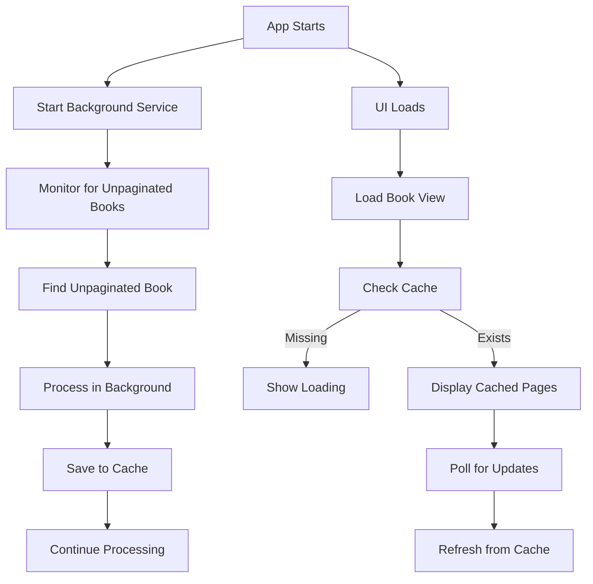

# PGN-9: Decoupled Background Pagination Architecture

## Overview

Implement a completely decoupled pagination system where:
1. A background service continuously monitors and paginates books
2. Frontend always reads from the pagination cache
3. No direct communication between pagination and UI

## Architecture Design

### Background Pagination Service

```swift
class BackgroundPaginationService {
    private let persistenceService: PersistenceService
    private let fileProcessor: FileProcessor
    private var paginationQueue: DispatchQueue
    private var isProcessing = false
    
    init() {
        self.paginationQueue = DispatchQueue(
            label: "com.readAloud.pagination",
            qos: .background
        )
    }
    
    /// Start monitoring for unpaginated books
    func startMonitoring() {
        paginationQueue.async { [weak self] in
            while true {
                self?.checkAndProcessNextBook()
                Thread.sleep(forTimeInterval: 5.0) // Check every 5 seconds
            }
        }
    }
    
    private func checkAndProcessNextBook() {
        // 1. Get all books from library
        let books = persistenceService.loadBookLibrary()
        
        // 2. Get current user settings
        let settings = persistenceService.loadUserSettings()
        
        // 3. Get current view size (from saved state)
        let viewSize = persistenceService.loadLastViewSize()
        
        // 4. Find first book that needs pagination
        for book in books {
            let cacheKey = PaginationCache.cacheKey(
                bookHash: book.contentHash,
                settings: settings,
                viewSize: viewSize
            )
            
            let cache = try? persistenceService.loadPaginationCache(
                bookHash: book.contentHash,
                settingsKey: cacheKey
            )
            
            if cache == nil || !cache.isComplete {
                // Found a book that needs pagination
                processBook(book, settings: settings, viewSize: viewSize, existingCache: cache)
                break // Process one book at a time
            }
        }
    }
    
    private func processBook(_ book: Book, 
                           settings: UserSettings, 
                           viewSize: CGSize,
                           existingCache: PaginationCache?) {
        
        // Load book content
        let content = try? fileProcessor.loadContent(from: book.fileURL)
        guard let content = content else { return }
        
        // Create pagination service
        let paginationService = PaginationService(
            bookHash: book.contentHash,
            persistenceService: persistenceService
        )
        
        // Process incrementally (synchronous version)
        var currentIndex = existingCache?.lastProcessedIndex ?? 0
        var pages = existingCache?.pages ?? []
        
        while currentIndex < content.count {
            // Calculate next 10 pages
            let batch = paginationService.calculateNextBatch(
                content: content,
                startIndex: currentIndex,
                settings: settings,
                viewSize: viewSize,
                batchSize: 10
            )
            
            pages.append(contentsOf: batch.pages)
            currentIndex = batch.lastIndex
            
            // Save progress
            let cache = PaginationCache(
                bookHash: book.contentHash,
                settingsKey: cacheKey,
                viewSize: viewSize,
                pages: pages,
                lastProcessedIndex: currentIndex,
                isComplete: currentIndex >= content.count,
                lastUpdated: Date()
            )
            
            try? persistenceService.savePaginationCache(cache)
            
            // Small delay to not hog resources
            Thread.sleep(forTimeInterval: 0.1)
        }
    }
}
```

### Simplified Frontend (ReaderViewModel)

```swift
class ReaderViewModel: ObservableObject {
    @Published var bookPages: [String] = []
    @Published var totalPages: Int = 0
    @Published var isPaginationComplete = false
    @Published var paginationProgress: Double = 0.0
    
    private let persistenceService: PersistenceService
    private var cacheCheckTimer: Timer?
    
    func loadBook() {
        // Simply load from cache
        loadFromCache()
        
        // Set up periodic cache checking
        cacheCheckTimer = Timer.scheduledTimer(withTimeInterval: 2.0, repeats: true) { _ in
            self.loadFromCache()
        }
    }
    
    private func loadFromCache() {
        let cacheKey = PaginationCache.cacheKey(
            bookHash: book.contentHash,
            settings: coordinator.userSettings,
            viewSize: currentContentSize
        )
        
        guard let cache = try? persistenceService.loadPaginationCache(
            bookHash: book.contentHash,
            settingsKey: cacheKey
        ) else {
            // No cache yet, show loading state
            showLoadingState()
            return
        }
        
        // Update UI from cache
        bookPages = cache.pages.map { $0.content }
        totalPages = cache.isComplete ? bookPages.count : max(bookPages.count + 10, estimatedTotalPages)
        isPaginationComplete = cache.isComplete
        paginationProgress = Double(cache.pages.count) / Double(estimatedTotalPages)
        
        // Update current page content if needed
        if currentPage < bookPages.count {
            updatePageContent()
        }
        
        // Stop checking if complete
        if cache.isComplete {
            cacheCheckTimer?.invalidate()
            cacheCheckTimer = nil
        }
    }
    
    deinit {
        cacheCheckTimer?.invalidate()
    }
}
```

## Key Benefits

### 1. **Complete Decoupling**
- Frontend doesn't know about pagination logic
- Pagination doesn't know about UI state
- Clean separation of concerns

### 2. **Navigation Independence**
- **Page turning is just UI state change** - no effect on pagination
- No more reload bugs (like PGN-6)
- No more lost pagination progress
- User can navigate freely without any pagination impact

### 3. **Simplicity**
- Frontend just reads from cache
- No complex delegate patterns
- No async coordination issues

### 4. **Robustness**
- App can crash, pagination continues on next launch
- Background service can be paused/resumed
- No lost work

### 5. **Scalability**
- Can process multiple books in queue
- Priority system possible (current book first)
- Resource management easier

### 6. **Testing**
- Frontend can be tested with mock cache
- Pagination can be tested without UI
- Much easier unit testing

## Implementation Flow

### App Launch


### Cache Structure
```
Documents/
└── PaginationCache/
    └── {bookHash}/
        ├── pagination-{settingsKey}.json
        └── metadata.json  // Track settings versions
```

### Priority System

```swift
enum PaginationPriority {
    case currentlyReading    // Highest priority
    case recentlyOpened     // Medium priority  
    case inLibrary          // Low priority
}

struct PaginationTask {
    let book: Book
    let priority: PaginationPriority
    let addedDate: Date
}
```

## Advantages Over PGN-8

1. **No Delegate Complexity**: No need for delegate patterns or callbacks
2. **Better Resource Usage**: Background thread runs at lower priority
3. **Crash Resilient**: Work continues after app restart
4. **Simpler Frontend**: UI just polls cache, no pagination logic
5. **Better Testing**: Can test pagination without running UI

## Migration Path

1. Keep existing PaginationService core logic
2. Add BackgroundPaginationService wrapper
3. Modify ReaderViewModel to poll cache
4. Remove delegate patterns
5. Add cache metadata for version tracking

## What Triggers Repagination vs What Doesn't

### Triggers Repagination ✓
1. **Settings Change**: Font name, size, or line spacing modified
2. **View Size Change**: Device rotation or window resize  
3. **Book Content Modified**: File edited (content hash changes)
4. **Cache Cleared**: Manual cache clear or app data reset

### Does NOT Trigger Repagination ✗
1. **Page Navigation**: Swiping between pages
2. **App Background/Foreground**: Switching apps
3. **View Hierarchy Changes**: Navigation to/from reader
4. **Progress Updates**: Saving reading position
5. **UI State Changes**: Toolbar show/hide, etc.

This is a **massive improvement** over the current architecture where page navigation could trigger view reloads and restart pagination.

## Edge Cases Handled

1. **Settings Change**: Cache key changes, new pagination starts
2. **Book Modified**: Content hash changes, re-pagination triggered  
3. **App Killed**: Background service resumes on next launch
4. **Low Memory**: Background service can be throttled
5. **Multiple Books**: Process in priority order

## Performance Considerations

- Background queue at `.background` QoS
- Batch saves to reduce I/O
- Efficient cache key generation
- Periodic cleanup of old caches
- Throttling when on battery

## Future Enhancements

1. **Push Notifications**: Notify when book fully paginated
2. **Cloud Sync**: Share pagination cache across devices
3. **Predictive Pagination**: Pre-paginate books likely to be read
4. **Multi-threaded**: Process multiple books in parallel
5. **Smart Scheduling**: Paginate when device is charging

## Conclusion

This decoupled architecture provides a much cleaner, more robust solution that:
- Simplifies the frontend code significantly
- Makes the system more reliable
- Provides better user experience
- Is easier to maintain and test
- Scales better for future features
