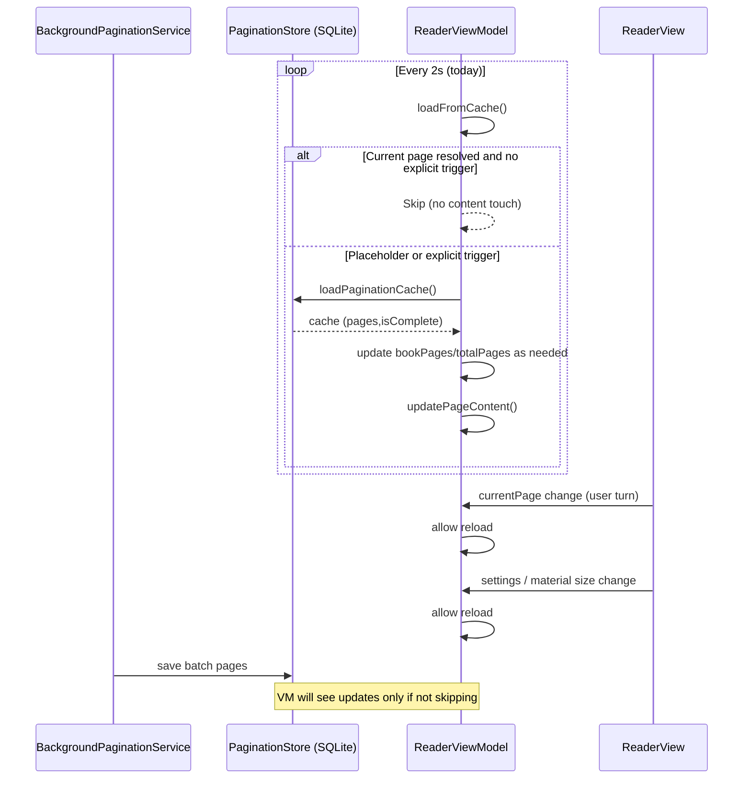

### BUG-4: TTS is repeatedly interrupted by background reloads when user is not interacting

#### Summary
When Text‑to‑Speech (TTS) is active, speech is frequently interrupted and restarted even when the user does not tap or turn pages. Logs show a repeating cycle of cache reloads and `updatePageContent()` calls driven by periodic polling and transient view-size changes, which stop and restart TTS.

#### Symptoms
- Audible TTS stutters/restarts every few seconds.
- Repeating logs without user input:
  - `📖 ReaderViewModel: Loaded N pages from cache (complete: false)`
  - `pageContent:` (same content reprinted)
  - Periodic `📄 PaginationService: calculatePageRange(TextKit)...` lines from background pagination batches
  - `📐 PageView[..]: effectiveDrawableWidth=0.0` transient size logs

#### Root Cause Analysis
- **Timer-driven cache polling**: `ReaderViewModel` sets a 2s `Timer` to `loadFromCache()`. Each successful load updates `bookPages` and calls `updatePageContent()`. If TTS is active, `updatePageContent()` executes `speech.stop()` then `speak(...)`, regardless of whether page content effectively changed.
- **Background pagination churn**: Background paginator writes batches (e.g., +10 pages). The reader polling observes page-count changes and treats them as a reload event, causing a TTS restart even when the current page content is unchanged.
- **Geometry zero-size churn**: `ReaderView` forwards every `geometry.size` change, including transient `(0, 0)` sizes, as a “material” update to `updateViewSize(...)`, indirectly triggering reloads.
- **Navigation churn (less frequent now)**: Any call to `navigateToLibrary()` or `navigateToReader(...)` re-creates `ReaderViewModel`, which stops TTS. Latest captures suggest polling/size-changes are the main trigger.

#### Scope and Non-Goals
- **Scope**: Stop unnecessary reloads when the current page already shows real (non-placeholder) content and no user page turn occurred. Preserve updates on real triggers (page turn, settings change, material view-size change, or when the current page is still a placeholder).
- **Non-Goals**: No change to background pagination batching cadence; no migration to notification-first architecture in this ticket (see Future Work).

#### Proposed Fix (Behavioral Contract)
- While the currently displayed page is backed by real content (`currentPage < bookPages.count`), **skip periodic cache reloads**. Only reload cache when:
  - **User turns page** (explicit navigation updates `currentPage`), or
  - **User settings change** (font, spacing, theme, TTS settings), or
  - **Material view-size change** (drawable width/height integer values change), or
  - **Current page is a placeholder** (user navigated past processed range), or
  - **ReaderViewModel just initialized** and has not yet populated content.
- Additionally, ensure `updatePageContent()` **does not stop/restart TTS** if the actual `pageContent` string for the current page is identical.

#### Implementation Plan (edits overview; no code in this ticket)
- `ReadAloudApp/Sources/ReadAloudApp/ViewModels/ReaderViewModel.swift`
  1) Add a lightweight guard in the polling path:
     - Before reading from cache inside `loadFromCache()`, check if the current page is already resolved from `bookPages` and there is no explicit trigger (page turn/settings/material size change/placeholder). If so, early-return without touching `bookPages`/`totalPages`/`pageContent`.
  2) Tighten `updatePageContent()` idempotency:
     - Compare new content vs existing `pageContent`. If unchanged, return early; do not call `speech.stop()`/`speak(...)`.
  3) Ensure size updates are material only:
     - `updateViewSize(...)` should ignore transient zero sizes and only trigger reloads on integer-changes of width/height.

- `ReadAloudApp/Sources/ReadAloudApp/Views/ReaderView.swift`
  4) If necessary/agreeable, filter out `(0,0)` geometry sizes before calling `updateViewSize(...)` to reduce churn. (Optional if ViewModel already filters.)

- No navigation changes in this ticket.

Pseudocode guard (illustrative only):
```swift
// Inside ReaderViewModel.loadFromCache()
let currentResolved = !bookPages.isEmpty && currentPage < bookPages.count
if currentResolved && !explicitTrigger {
    return // skip touching content to avoid TTS restart
}
```

#### Acceptance Criteria
- **AC1**: With TTS active on a fully loaded page, no audible interruption/restart occurs while the user is idle for at least 30 seconds, even as background pagination continues.
- **AC2**: Turning to a placeholder page resumes periodic polling, and TTS switches to the new page once content arrives (single stop/start allowed due to page change).
- **AC3**: Changing any layout-related setting (font, size, spacing, theme) still triggers a proper reload and, if TTS was active, restarts speech for the new page content.
- **AC4**: Material view-size changes (e.g., rotation or safe-area affecting drawable width/height) still trigger reload; transient zero-size layouts do not cause TTS restarts.
- **AC5**: No regression in page count, pagination progress reporting, or cache completeness updates.

#### Validation Plan
- Manual
  - Start TTS on a fully loaded page; observe for 60s. Background pagination logs should continue, but TTS must not restart.
  - Navigate to a page beyond processed range; verify TTS restarts only once when real content arrives.
  - Change font size; verify reload and a single TTS restart with updated content.
  - Rotate device; verify reload only on real drawable dimension change (no churn on transient zero).

- Automated Tests (XCTest)
  - Add a unit test to simulate: TTS active, `bookPages` populated, timer tick calling `loadFromCache()` → verify no changes to `pageContent` and no TTS stop/start when content unchanged.
  - Add a test for placeholder state: when `currentPage >= bookPages.count`, periodic polling proceeds; once cache returns new page content, `pageContent` changes exactly once.
  - Add a test that `updatePageContent()` early-returns (no speak) when content identical.

#### Risks & Mitigations
- Risk: Skipping reloads might delay progress percentage or total page updates while idle.
  - Mitigation: Update progress/total counts lazily on next explicit trigger (page turn/settings/size change) or allow a background update of totals that does not touch `pageContent`.
- Risk: Edge case where background pagination updates attributes affecting current page layout without page index change.
  - Mitigation: Treat settings and material size as explicit triggers; page content should remain stable otherwise.

#### Future Work (Out of scope)
- Event-driven reader updates: Replace polling with a notification posted by the background paginator after batch commits, carrying minimal metadata (pagesCount, isComplete). The reader would only refresh when needed.

#### Diagram


#### Checklist
- [ ] Implement guards in `ReaderViewModel.loadFromCache()` and `updatePageContent()` (idempotency)
- [ ] Filter zero-size geometry in `updateViewSize(...)` and/or `ReaderView`
- [ ] Add unit tests for skip-when-resolved and placeholder-resume behaviors
- [ ] Verify manual scenarios (AC1–AC5)
- [ ] Update `CHANGELOG.md` upon completion


