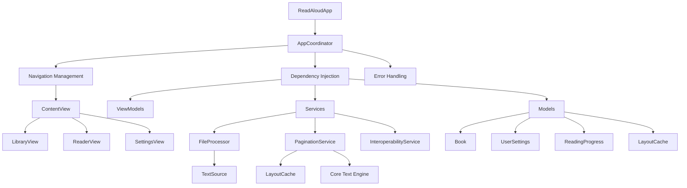

# Project Context - ReadAloudApp

## Project Overview

ReadAloudApp is a sophisticated iOS application designed to provide an exceptional reading experience for large text files. The app combines advanced text processing capabilities with modern iOS design patterns to deliver a high-performance, user-friendly reading platform.

## 🎯 Project Objectives

### Primary Goals
1. **High Performance**: Handle text files up to 2GB efficiently without performance degradation
2. **User Experience**: Provide smooth, responsive reading interface with customizable settings
3. **Accessibility**: Support text-to-speech with synchronized highlighting
4. **Reliability**: Robust error handling and graceful degradation
5. **Maintainability**: Clean architecture with comprehensive documentation

### Target Audience
- **Students**: Reading textbooks and academic materials
- **Professionals**: Consuming long-form documents and reports
- **Accessibility Users**: Those requiring text-to-speech functionality
- **Heavy Readers**: Users dealing with large text files regularly

## 🏗️ Technical Architecture

### Architectural Philosophy
The app follows a **MVVM-C (Model-View-ViewModel-Coordinator)** pattern to ensure:
- Clear separation of concerns
- Testable business logic
- Centralized navigation management
- Scalable dependency injection

### System Architecture

## 📋 Feature Roadmap

### Epic 1: Core Architecture ✅
**Status**: Complete  
**Objectives**: Establish foundation and basic structure
- MVVM-C architecture implementation
- Core data models (Book, UserSettings, ReadingProgress)
- Centralized error handling system
- Swift/Objective-C interoperability

### Epic 2: File Processing ✅
**Status**: Complete  
**Objectives**: Implement robust file handling
- Hybrid loading strategy (memory-mapped + streaming)
- TextSource abstraction layer
- Automatic file size detection
- Async/await processing patterns

### Epic 3: UI Framework ✅
**Status**: Complete  
**Objectives**: Build complete user interface
- SwiftUI views for all screens
- Reactive ViewModels with Combine
- Navigation coordination
- Error handling UI components

### Epic 4: Pagination Engine 🔄
**Status**: In Progress (90% complete)  
**Objectives**: Implement Core Text-powered pagination
- **PGN-1**: PaginationService and LayoutCache foundation ✅
- **PGN-2**: Core Text implementation (90% complete)
- Background thread processing
- Intelligent caching with expiration

### Epic 5: Text-to-Speech 📋
**Status**: Planned  
**Objectives**: Add comprehensive TTS functionality
- AVSpeechSynthesizer integration
- Synchronized text highlighting
- Multi-language voice detection
- Audio session management

### Epic 6: State Persistence 📋
**Status**: Planned  
**Objectives**: Implement data persistence
- Settings persistence across launches
- Reading progress tracking
- File import workflow
- Library management

### Epic 7: Advanced Features 📋
**Status**: Planned  
**Objectives**: Add premium functionality
- Bookmarks and annotations
- Search functionality
- Export and sharing capabilities
- Advanced typography controls

## 🔧 Technical Specifications

### Platform Requirements
- **iOS Version**: 17.0+
- **Swift Version**: 5.10+
- **Xcode Version**: 16.0+
- **Architecture**: arm64 (Apple Silicon optimized)

### Performance Targets
- **File Loading**: < 2 seconds for typical books
- **Memory Usage**: < 100MB for large files
- **UI Responsiveness**: 60fps maintained during pagination
- **Cache Hit Ratio**: 85%+ for typical reading patterns
- **Crash Rate**: < 0.1%

### File Processing Specifications
- **Memory-mapped Files**: < 1.5GB for optimal performance
- **Streaming Files**: ≥ 1.5GB to avoid virtual memory limits
- **Maximum File Size**: Limited by device memory (~2GB)
- **Supported Formats**: Plain text (.txt)

## 🎨 Design Principles

### User Experience
- **Simplicity**: Clean, intuitive interface
- **Customization**: Extensive typography and theme options
- **Accessibility**: VoiceOver and TTS support
- **Performance**: Smooth, responsive interactions

### Code Quality
- **Readability**: Clear, self-documenting code
- **Maintainability**: Modular architecture with clear boundaries
- **Testability**: Comprehensive unit and integration tests
- **Documentation**: Detailed technical documentation

### Error Handling
- **Graceful Degradation**: Fallback strategies for all failure modes
- **User-Friendly Messages**: Clear error communication
- **Recovery**: Automatic retry and recovery mechanisms
- **Logging**: Comprehensive debugging information

## 🔍 Current Implementation Status

### Core Infrastructure ✅
- **AppCoordinator**: Navigation and dependency injection
- **ContentView**: Root view with screen switching
- **Error Handling**: Comprehensive AppError system
- **Models**: Complete data structures with validation

### File Processing ✅
- **FileProcessor**: Hybrid loading with automatic strategy selection
- **TextSource**: Abstraction layer for different file types
- **Memory Management**: Efficient handling of large files
- **Error Recovery**: Graceful fallback mechanisms

### Pagination Engine 🔄
- **PaginationService**: Core Text integration (90% complete)
- **LayoutCache**: Intelligent caching with cleanup
- **Background Processing**: UI-responsive calculations
- **Performance Optimization**: O(1) cache lookup

### User Interface ✅
- **LibraryView**: Book collection management
- **ReaderView**: Paginated reading experience
- **SettingsView**: User preference management
- **Reactive Updates**: Combine-powered state management

## 🚀 Development Methodology

### Agile Approach
- **Epic-Based Planning**: Features organized into logical epics
- **Incremental Development**: Working software at each milestone
- **Continuous Integration**: Automated testing and validation
- **Documentation-Driven**: Comprehensive docs updated with code

### Quality Assurance
- **Unit Testing**: Business logic validation
- **Integration Testing**: Component interaction verification
- **Performance Testing**: Load and stress testing
- **User Testing**: UI/UX validation

### Version Control
- **Git Workflow**: Feature branches with pull requests
- **Commit Standards**: Descriptive messages with epic references
- **Code Review**: Peer review for all changes
- **Documentation**: Updated with each feature implementation

## 📊 Success Metrics

### Performance Metrics
- **Load Time**: File loading performance
- **Memory Usage**: Memory efficiency during operation
- **UI Responsiveness**: Frame rate during interactions
- **Cache Efficiency**: Hit/miss ratios for layout cache

### User Experience Metrics
- **Crash Rate**: Application stability
- **User Satisfaction**: Reading experience quality
- **Feature Adoption**: Usage of advanced features
- **Accessibility**: Support for diverse user needs

## 🔮 Future Enhancements

### Short-term (Next 2 weeks)
1. Complete PGN-2 Core Text integration
2. Add comprehensive unit test coverage
3. Implement file import workflow
4. Add settings persistence

### Medium-term (Next month)
1. Implement TTS with synchronized highlighting
2. Add reading progress persistence
3. Implement search functionality
4. Add advanced typography controls

### Long-term (Next quarter)
1. Add bookmarks and annotations
2. Implement export/sharing features
3. Add multi-language support
4. Performance optimization for very large files

## 🤝 Team Structure

### Development Roles
- **Technical Lead**: Architecture and technical decisions
- **iOS Developer**: Feature implementation and testing
- **UI/UX Designer**: User experience design
- **QA Engineer**: Testing and quality assurance

### Collaboration Tools
- **Version Control**: Git with feature branches
- **Documentation**: Markdown with mermaid diagrams
- **Testing**: Xcode Test Navigator
- **Communication**: Code reviews and documentation

## 📝 Documentation Strategy

### Documentation Types
- **Technical Documentation**: Architecture and implementation details
- **User Documentation**: Feature usage and troubleshooting
- **API Documentation**: Service and model specifications
- **Process Documentation**: Development workflows and standards

### Maintenance
- **Living Documentation**: Updated with each feature
- **Version Control**: Documentation tracked with code
- **Review Process**: Documentation reviewed with code changes
- **Standards**: Consistent formatting and terminology

---

**Project Status**: Active Development  
**Current Epic**: Epic 4 - Pagination Engine  
**Last Updated**: December 2024  
**Next Milestone**: PGN-2 Core Text Integration Complete