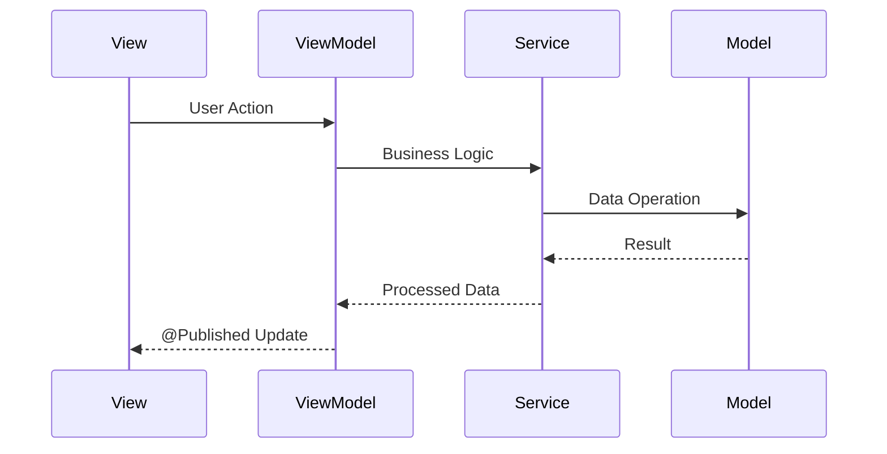

# Quick Reference - ReadAloudApp

## Project Info
- **Name**: ReadAloudApp
- **Platform**: iOS 17.0+
- **Architecture**: MVVM-C (Model-View-ViewModel-Coordinator)
- **UI Framework**: SwiftUI
- **Language**: Swift 5.10+

## Key Commands

### Build & Run
```bash
# Open in Xcode
cd ReadAloudApp && open -a Xcode Package.swift

# Run tests
swift test

# Build from command line
swift build
```

### Project Navigation
- **Main App**: `Sources/ReadAloudApp/ReadAloudApp.swift`
- **Navigation**: `Sources/ReadAloudApp/Coordinators/AppCoordinator.swift`
- **Views**: `Sources/ReadAloudApp/Views/`
- **ViewModels**: `Sources/ReadAloudApp/ViewModels/`
- **Models**: `Sources/ReadAloudApp/Models/`

## Core Classes & Responsibilities

| Class | Type | Responsibility |
|-------|------|----------------|
| `AppCoordinator` | Class | Navigation & dependency injection |
| `ContentView` | View | Root view managing screen transitions |
| `LibraryView` | View | Display book collection |
| `ReaderView` | View | Display paginated book content |
| `SettingsView` | View | User preferences |
| `Book` | Struct | Book data model |
| `LibraryViewModel` | Class | Library screen logic |
| `ReaderViewModel` | Class | Reader screen logic |
| `SettingsViewModel` | Class | Settings screen logic |

## Navigation Flow

```
AppCoordinator.currentView (enum)
├── .library → LibraryView
├── .reader → ReaderView (requires selectedBook)
└── .settings → SettingsView
```

## Data Flow



## Key Properties

### AppCoordinator
- `@Published var currentView: AppView`
- `@Published var selectedBook: Book?`

### Book Model
- `id: UUID`
- `title: String`
- `fileURL: URL`
- `contentHash: String`
- `importedDate: Date`
- `fileSize: Int64`

### UserSettings Model
- `fontName: String` (default: "System")
- `fontSize: CGFloat` (default: 16.0)
- `theme: String` (default: "light")
- `lineSpacing: CGFloat` (default: 1.2)
- `speechRate: Float` (default: 1.0)

### ReadingProgress Model
- `bookID: String` (matches Book.contentHash)
- `lastReadCharacterIndex: Int`
- `lastPageNumber: Int?`
- `totalPages: Int?`
- `percentageComplete: Double?`
- `lastUpdated: Date`

### ViewModels Pattern
```swift
class SomeViewModel: ObservableObject {
    @Published var state: State
    private let coordinator: AppCoordinator
    
    init(coordinator: AppCoordinator) {
        self.coordinator = coordinator
    }
}
```

## File Size Limits
- Memory-mapped loading: < 1.5GB
- Streaming fallback: ≥ 1.5GB
- iOS virtual memory limit: ~2GB

## Planned Services

1. **FileProcessor**: File I/O and hashing
2. **PaginationService**: Text layout calculation
3. **SpeechService**: TTS functionality
4. **PersistenceService**: Settings & progress

## Common Tasks

### Add New View
1. Create View in `Views/`
2. Create ViewModel in `ViewModels/`
3. Add case to `AppCoordinator.AppView`
4. Update `ContentView` switch statement
5. Add navigation method to `AppCoordinator`

### Add New Model
1. Create struct in `Models/`
2. Conform to `Codable` if persistent
3. Conform to `Identifiable` if in lists
4. Add to relevant ViewModels

### Add New Service
1. Create class in `Services/`
2. Add as lazy property in `AppCoordinator`
3. Inject into ViewModels as needed

## Testing Checklist
- [ ] Unit tests for Models
- [ ] Unit tests for ViewModels
- [ ] Unit tests for Services
- [ ] UI tests for critical flows
- [ ] Performance tests for large files

## Debug Tips
- Use `print()` in ViewModels for state debugging
- Check `@Published` property updates
- Verify Coordinator state transitions
- Monitor memory usage with large files

## Git Workflow
```bash
# Feature branch
git checkout -b feature/CORE-X-description

# Commit with ticket reference
git commit -m "CORE-X: Description of change"

# Update CHANGELOG.md before merging
``` 