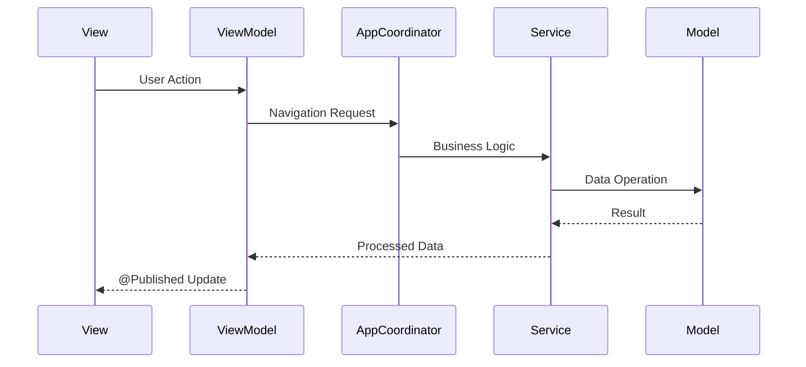

# Quick Reference - ReadAloudApp

## Project Info
- **Name**: ReadAloudApp
- **Platform**: iOS 17.0+
- **Architecture**: MVVM-C (Model-View-ViewModel-Coordinator)
- **UI Framework**: SwiftUI
- **Language**: Swift 5.10+ with Objective-C interoperability

## Key Commands

### Build & Run
```bash
# Open in Xcode
cd ReadAloudApp && open ReadAloudApp.xcodeproj

# Build from command line
xcodebuild -scheme ReadAloudApp -destination 'platform=iOS Simulator,name=iPhone 16' build

# Run tests
swift test
```

### Project Navigation
- **Main App**: `Sources/ReadAloudApp/ReadAloudApp.swift`
- **Navigation**: `Sources/ReadAloudApp/Coordinators/AppCoordinator.swift`
- **Views**: `Sources/ReadAloudApp/Views/`
- **ViewModels**: `Sources/ReadAloudApp/ViewModels/`
- **Models**: `Sources/ReadAloudApp/Models/`
- **Services**: `Sources/ReadAloudApp/Services/`
- **Utilities**: `Sources/ReadAloudApp/Utilities/`

## Core Classes & Responsibilities

| Class | Type | Status | Responsibility |
|-------|------|--------|----------------|
| `AppCoordinator` | Class | ✅ Complete | Navigation, dependency injection, factory methods |
| `ContentView` | View | ✅ Complete | Root view managing screen transitions |
| `LibraryView` | View | ✅ Complete | Display book collection with import functionality |
| `ReaderView` | View | ✅ Complete | Display paginated book content |
| `SettingsView` | View | ✅ Complete | User preferences interface |
| `PageView` | View | ✅ Complete | Individual page display with UITextView |
| `Book` | Struct | ✅ Complete | Book data model with content hash |
| `UserSettings` | Struct | ✅ Complete | User preferences (font, theme, TTS) |
| `ReadingProgress` | Struct | ✅ Complete | Reading position tracking |
| `LayoutCache` | Class | ✅ Complete | Intelligent layout caching system |
| `LibraryViewModel` | Class | ✅ Complete | Library screen logic |
| `ReaderViewModel` | Class | ✅ Complete | Reader screen logic with pagination |
| `SettingsViewModel` | Class | ✅ Complete | Settings screen logic |
| `FileProcessor` | Class | ✅ Complete | Hybrid file loading (memory-mapped + streaming) |
| `PaginationService` | Class | 🔄 In Progress | Core Text pagination engine |
| `InteroperabilityService` | Class | ✅ Complete | Swift/Objective-C bridge demonstration |
| `LegacyTextProcessor` | Class | ✅ Complete | Objective-C interoperability example |
| `AppError` | Enum | ✅ Complete | Centralized error handling |

## Navigation Flow

```
AppCoordinator.currentView (enum)
├── .library → LibraryView (default)
├── .reader → ReaderView (requires selectedBook)
├── .settings → SettingsView  
└── .loading → LoadingView
```

## Data Flow



## Key Properties

### AppCoordinator
- `@Published var currentView: AppView` - Current screen state
- `@Published var selectedBook: Book?` - Currently selected book
- `@Published var isLoading: Bool` - Loading state
- `@Published var errorMessage: String?` - Error display
- `@Published var userSettings: UserSettings` - Global user settings

### Book Model
- `id: UUID` - Unique identifier
- `title: String` - Book title (from filename)
- `fileURL: URL` - Location in app sandbox
- `contentHash: String` - SHA256 hash for content identification
- `importedDate: Date` - When book was added
- `fileSize: Int64` - File size in bytes

### UserSettings Model
- `fontName: String` - Font family (default: "System")
- `fontSize: CGFloat` - Font size (default: 16.0, range: 12.0-32.0)
- `theme: String` - Color theme (default: "light")
- `lineSpacing: CGFloat` - Line spacing multiplier (default: 1.2, range: 0.8-2.0)
- `speechRate: Float` - TTS speed (default: 1.0, range: 0.5-2.0)

### ReadingProgress Model
- `bookID: String` - Links to Book.contentHash
- `lastReadCharacterIndex: Int` - Character position
- `lastPageNumber: Int?` - Page number for UI
- `totalPages: Int?` - Total page count
- `percentageComplete: Double?` - Progress percentage (0.0-1.0)
- `lastUpdated: Date` - Timestamp

### LayoutCache
- `maxCacheSize: Int = 50` - Maximum cached layouts
- `maxCacheAge: TimeInterval = 300` - 5-minute expiration
- Dual caching: Complex layouts + simple string-key caching

## File Processing Strategy

### TextSource Enum
```swift
enum TextSource {
    case memoryMapped(NSData)    // Files < 1.5GB
    case streaming(FileHandle)   // Files ≥ 1.5GB
}
```

### File Size Thresholds
- **Memory-mapped loading**: Files < 1.5GB
- **Streaming loading**: Files ≥ 1.5GB
- **Virtual memory limit**: ~2GB on iOS

### Loading Process
1. **File size check** → Strategy selection
2. **Memory-mapped**: `NSData(contentsOfFile:options:.mappedIfSafe)`
3. **Streaming**: `NSFileHandle` with chunked reading
4. **Error handling**: Graceful fallback with detailed error messages

## Core Text Pagination Engine

### PaginationService Methods
```swift
// Legacy placeholder methods
func pageRange(for pageNumber: Int) -> NSRange
func totalPageCount() -> Int

// New Core Text methods (PGN-2)
func pageRange(for pageNumber: Int, bounds: CGRect) async -> NSRange
func totalPageCount(bounds: CGRect) async -> Int
```

### Core Text Process
1. **Text → NSAttributedString** with user settings
2. **CTFramesetterCreateWithAttributedString** for layout
3. **CTFramesetterCreateFrame** within bounds
4. **CTFrameGetStringRange** for character ranges
5. **Background processing** on `DispatchQueue.global(qos: .userInitiated)`
6. **Intelligent caching** with expiration

## Error Handling

### AppError Categories
- **File Operations**: `fileNotFound`, `fileReadFailed`, `fileTooLarge`
- **Text Processing**: `paginationFailed`, `encodingError`
- **TTS**: `ttsError`, `voiceNotAvailable`, `ttsNotSupported`
- **Storage**: `saveFailed`, `loadFailed`, `insufficientStorage`
- **Network**: `noNetworkConnection`, `downloadFailed`
- **General**: `unknown`, `notImplemented`

### Error Severity Levels
- **INFO**: Non-critical (file too large, feature not implemented)
- **WARNING**: Recoverable (file not found, invalid format)
- **ERROR**: Functional problems (read failed, pagination failed)
- **CRITICAL**: System issues (unknown errors, TTS not supported)

## ViewModels Pattern
```swift
class SomeViewModel: ObservableObject {
    @Published var state: State
    private let coordinator: AppCoordinator
    
    init(coordinator: AppCoordinator) {
        self.coordinator = coordinator
        setupObservation()
    }
    
    private func setupObservation() {
        // Observe coordinator changes
        coordinator.$userSettings
            .dropFirst()
            .sink { [weak self] newSettings in
                self?.handleSettingsChange()
            }
            .store(in: &cancellables)
    }
}
```

## Service Factory Pattern
```swift
// AppCoordinator factory methods
func makePaginationService(textSource: TextSource, userSettings: UserSettings? = nil) -> PaginationService
func makeLibraryViewModel() -> LibraryViewModel
func makeReaderViewModel(for book: Book) -> ReaderViewModel
func makeSettingsViewModel() -> SettingsViewModel
```

## Common Tasks

### Add New View
1. Create View in `Views/`
2. Create ViewModel in `ViewModels/`
3. Add case to `AppCoordinator.AppView`
4. Update `ContentView` switch statement
5. Add navigation method to `AppCoordinator`
6. Add factory method for ViewModel

### Add New Model
1. Create struct in `Models/`
2. Conform to `Codable` if persistent
3. Conform to `Identifiable` if in lists
4. Add validation methods if needed
5. Add to relevant ViewModels

### Add New Service
1. Create class in `Services/`
2. Add as lazy property in `AppCoordinator`
3. Inject into ViewModels as needed
4. Add comprehensive debug logging
5. Include error handling with `AppError`

### Add Background Processing
1. Use `DispatchQueue.global(qos: .userInitiated)` for heavy work
2. Implement async/await patterns
3. Use `@MainActor` for UI updates
4. Add progress tracking where appropriate

## Testing Strategy

### Unit Test Categories
- [ ] Model validation and serialization
- [ ] Service business logic
- [ ] ViewModel state management
- [ ] Error handling scenarios
- [ ] File processing strategies
- [ ] Cache performance

### Integration Tests
- [ ] File loading end-to-end
- [ ] Pagination accuracy
- [ ] Navigation flow
- [ ] Settings persistence
- [ ] Memory usage under load

## Performance Monitoring

### Debug Output Patterns
```swift
debugPrint("📄 ServiceName: Operation description")
debugPrint("⚠️ ServiceName: Warning message")
debugPrint("❌ ServiceName: Error occurred")
debugPrint("🗂️ ServiceName: Cache operation")
debugPrint("♻️ ServiceName: Cleanup/deinit")
```

### Cache Performance
- Monitor cache hit/miss ratios
- Track memory usage growth
- Measure background thread utilization
- Monitor UI responsiveness during heavy operations

## Current Development Status

### ✅ Completed
- **Core Architecture**: MVVM-C with full dependency injection
- **File Processing**: Hybrid loading strategy with automatic fallback
- **Basic UI**: All primary views and navigation
- **Data Models**: Complete with validation and serialization
- **Error Handling**: Comprehensive with severity levels
- **Swift/Objective-C Interop**: Working bridging header

### 🔄 In Progress
- **PGN-2**: Core Text pagination engine (core methods complete, integration in progress)

### 📋 Planned
- **TTS Integration**: AVSpeechSynthesizer with synchronized highlighting
- **File Import**: Document picker workflow
- **Progress Persistence**: Save/restore reading positions
- **Advanced Features**: Bookmarks, search, annotations

## Git Workflow
```bash
# Feature branch
git checkout -b feature/EPIC-X-description

# Commit with ticket reference
git commit -m "EPIC-X: Description of change"

# Update documentation
# - Update CHANGELOG.md
# - Update relevant docs/ files
# - Add mermaid diagrams where applicable
```

## Debug Tips
- Use `debugPrint()` with emoji prefixes for easy filtering
- Monitor `@Published` property updates in ViewModels
- Check `AppCoordinator` state transitions
- Verify cache hit/miss ratios for performance
- Test with large files (>1GB) to verify streaming strategy
- Use Xcode Memory Graph Debugger for memory leaks 